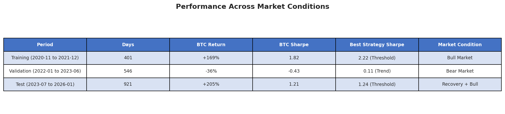
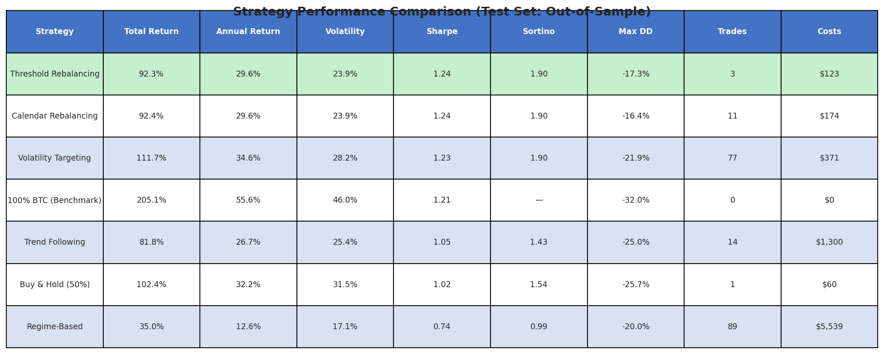
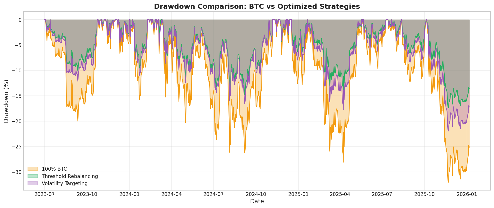
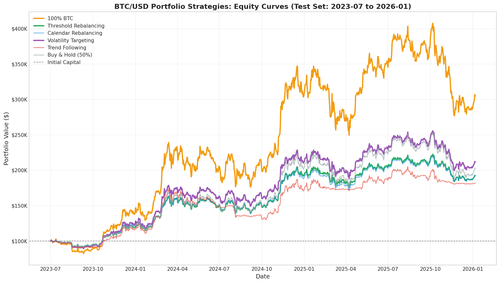
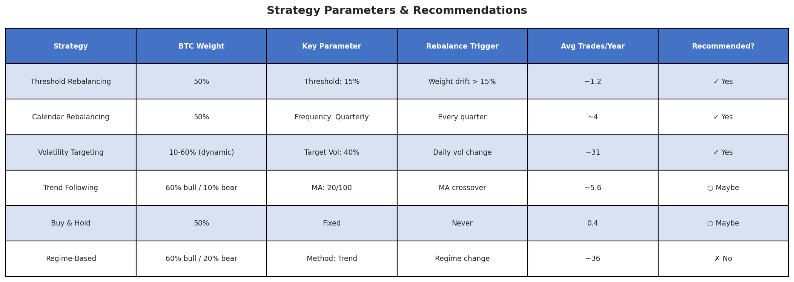

# Stop HODLing 100% BTC — Here's What 5 Years of Data Actually Says

## How Simple Rebalancing Rules Can Beat Pure Bitcoin Holdings on a Risk-Adjusted Basis

*Can you improve on simply holding Bitcoin? I ran rigorous backtests on six portfolio management strategies using real historical data from 2020-2026 to find out.*

---

## TL;DR

- **Best Strategy**: Threshold Rebalancing (50% BTC, rebalance when weight drifts >15%) achieved **Sharpe 1.24** vs Bitcoin's 1.21
- **Key Trade-off**: Optimized strategies earned ~92% vs BTC's 205%, but with **half the drawdown** (-17% vs -32%)
- **3 strategies beat BTC benchmark** on risk-adjusted basis: Threshold, Calendar, and Volatility Targeting
- **Regime-based strategies failed** due to overfitting and high transaction costs
- **Verdict**: Simple rebalancing rules work. Complex timing strategies don't.

---

## Part 1: The Question

If you had $100,000 and could only hold Bitcoin and cash (USD), how should you manage your portfolio to maximize risk-adjusted returns?

This isn't just an academic exercise. Many crypto investors face exactly this decision: how much to allocate to Bitcoin, and when (if ever) to rebalance.

The conventional wisdom varies wildly:
- **VanEck** recommends 5-8% crypto allocation in traditional portfolios
- **Kelly Criterion analysis** suggests ~33% Bitcoin for optimal growth
- **ARK Invest** finds 8% average optimal allocation across various timeframes

I wanted to test what actually works with real data, proper out-of-sample validation, and realistic transaction costs.

---

## Part 2: Methodology

### Data
- **Asset**: Bitcoin (BTC/USDT) from Binance Futures
- **Period**: May 2020 to January 2026 (5+ years)
- **Frequency**: Daily prices

### Train/Validation/Test Split

To prevent overfitting, I used strict temporal splits:


*Figure 1: The test data spans diverse market conditions—critical for validating strategy robustness.*

### Transaction Costs
- **Trading fee**: 0.10% (Binance standard)
- **Slippage**: 0.02%
- **Total round-trip**: ~0.24%

### Strategies Tested

**1. Buy-and-Hold**: Fixed 50% BTC allocation, never rebalance

**2. Calendar Rebalancing**: Return to target weight at fixed intervals (weekly/monthly/quarterly)

**3. Threshold Rebalancing**: Rebalance only when weight drifts beyond a threshold (5-20%)

**4. Volatility Targeting**: Dynamically adjust BTC weight to maintain constant portfolio volatility

**5. Trend Following**: Use moving average crossovers to time BTC exposure

**6. Regime-Based**: Vary allocation based on detected bull/bear market regime

---

## Part 3: Results

### Performance Summary


*Figure 2: Strategy performance on the out-of-sample test set (2023-07 to 2026-01). Green row indicates best risk-adjusted performer.*

### Key Finding #1: Three Strategies Beat Bitcoin's Sharpe Ratio

On a risk-adjusted basis, three strategies outperformed pure Bitcoin:

1. **Threshold Rebalancing** (Sharpe 1.24)
2. **Calendar Rebalancing** (Sharpe 1.24)
3. **Volatility Targeting** (Sharpe 1.23)

Bitcoin's Sharpe was 1.21—still excellent, but slightly lower.

### Key Finding #2: The Drawdown Story

This is where the real value emerges:


*Figure 3: Maximum drawdown comparison. The optimized strategies cut peak-to-trough losses nearly in half.*

Max Drawdown 
- 100% BTC: `-32.0%`
- Threshold Rebalancing: `-17.3%`
- Calendar Rebalancing: `-16.4%`
- Volatility Targeting: `-21.9%`

For a $100,000 portfolio:
- **100% BTC**: Lost up to $32,000 from peak
- **Threshold Rebalancing**: Lost up to $17,300 from peak

That's **$14,700 less pain** during drawdowns—a massive psychological advantage.

### Key Finding #3: Equity Curves Tell the Story


*Figure 4: Portfolio value over time. Notice how the optimized strategies provide smoother growth with less volatility.*

Bitcoin clearly had the highest total return (+205%), but look at the journey:
- Massive volatility and gut-wrenching drops
- The optimized strategies provided much smoother paths to +92-112% returns

---

## Part 4: Best Strategy Parameters


*Figure 5: Recommended parameters for each strategy based on out-of-sample optimization.*

### Recommended: Threshold Rebalancing

```
Target BTC Weight: 50%
Rebalance Threshold: 15%
Expected Annual Trades: ~1-2
```

**How it works:**
1. Start with 50% BTC, 50% USD
2. Monitor your BTC weight daily
3. If weight drifts to 35% or 65%, rebalance back to 50%
4. Otherwise, do nothing

This approach captures Bitcoin's upside while automatically taking profits during rallies and buying dips during crashes.

### Alternative: Volatility Targeting

For more active management:

```
Target Volatility: 40% annually
Volatility Window: 20 days
Max BTC Weight: 60%
Min BTC Weight: 10%
```

This dynamically reduces exposure when Bitcoin gets volatile (protecting capital) and increases exposure when it's calm (capturing returns).

---

## Part 5: What Didn't Work

### Regime-Based Allocation: A Cautionary Tale

The regime-based strategy had the **worst performance** (Sharpe 0.74), despite promising training results (Sharpe 2.01).

**Why it failed:**
1. **Overfitting**: Regime detection parameters optimized perfectly for historical patterns that didn't repeat
2. **Transaction costs**: 89 trades cost $5,539—eating into returns
3. **Lagging indicators**: By the time a regime was confirmed, the optimal entry was missed

**Lesson**: Complex timing strategies that work beautifully in backtests often fail in live markets.

### Trend Following: Mixed Results

Trend following (MA crossover) performed moderately (Sharpe 1.05), but:
- Higher transaction costs ($1,300) than simpler strategies
- Not significantly better than buy-and-hold
- Added complexity without commensurate benefit

---

## Part 6: Key Lessons Learned

### 1. Simple Rules Beat Complex Models

The best-performing strategies (Threshold, Calendar) are embarrassingly simple. No machine learning, no regime detection, no fancy indicators—just basic rebalancing rules.

### 2. Transaction Costs Matter More Than You Think

Strategy performance ranking changed dramatically once costs were included:
- Regime-based: 5.5% of capital eaten by fees
- Volatility targeting: Only 0.37% in fees

Always model realistic costs.

### 3. Out-of-Sample Testing is Non-Negotiable

Several strategies that looked amazing on training data (Sharpe > 2.0) fell apart on test data. Without strict temporal separation, you're just fooling yourself.

### 4. Drawdown Reduction Has Real Value

Even if total returns are lower, sleeping well at night has value. A -17% drawdown feels very different from -32%.

### 5. The Benchmark is Already Good

Bitcoin's Sharpe of 1.21 is excellent by any traditional asset standard. Beating it consistently is hard—and may not be worth the added complexity.

---

## Part 7: Final Verdict

**For most investors, I recommend Threshold Rebalancing:**

✅ Simple to implement and maintain
✅ Low transaction costs (~$50/year for $100K portfolio)
✅ Better risk-adjusted returns than pure Bitcoin
✅ Significantly reduced drawdowns
✅ Automatic "buy low, sell high" mechanism

**Implementation steps:**
1. Allocate 50% to BTC, 50% to USD (or stablecoins)
2. Check your allocation weekly
3. If BTC weight < 35% or > 65%, rebalance to 50/50
4. Ignore daily noise

**If you want higher returns and can tolerate more volatility:**
- Consider Volatility Targeting with 40% target vol
- Or simply hold 100% BTC if you have strong hands

---

## Appendix: Methodology Details

### Data Source
- Binance USD-M Futures daily OHLCV data
- Period: 2020-05-10 to 2026-01-06
- Total observations: 2,068 days

### Features Calculated
- Rolling volatility (20, 30, 60-day windows)
- Moving averages (20, 50, 100, 200-day)
- Drawdown from peak
- Trend strength indicators

### Optimization Process
1. Train on 2020-11 to 2021-12 (401 days)
2. Validate on 2022-01 to 2023-06 (546 days)
3. Test on 2023-07 to 2026-01 (921 days)
4. Select parameters based on training Sharpe
5. Report test set results only


---

## About This Research

- **Date**: January 2026
- **Data**: Binance historical futures data
- **Tools**: Python (pandas, numpy, matplotlib)

---

*Disclaimer: This research is for educational purposes only and does not constitute financial advice. Past performance does not guarantee future results. Cryptocurrency investments carry significant risk of loss. Always do your own research before investing.*

---

**Tags**: #Bitcoin #PortfolioManagement #QuantitativeFinance #CryptoInvesting #RiskManagement #Backtesting #InvestmentStrategy
