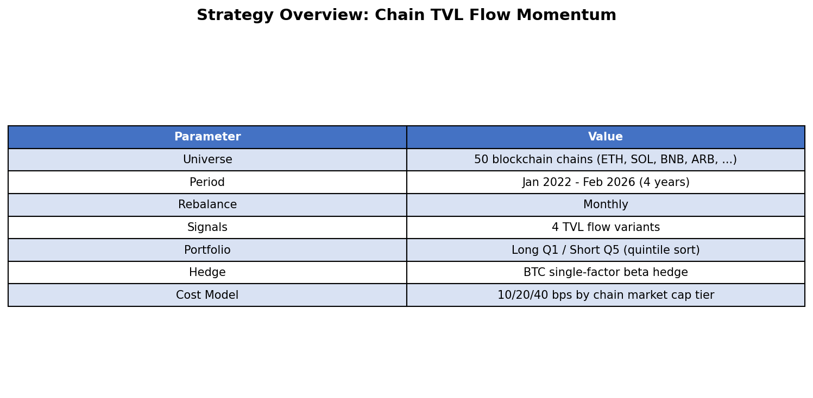
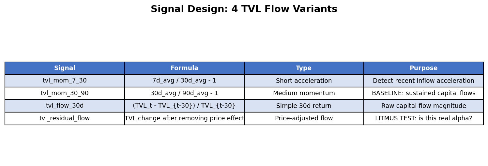
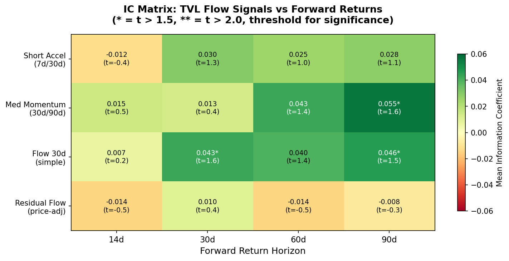
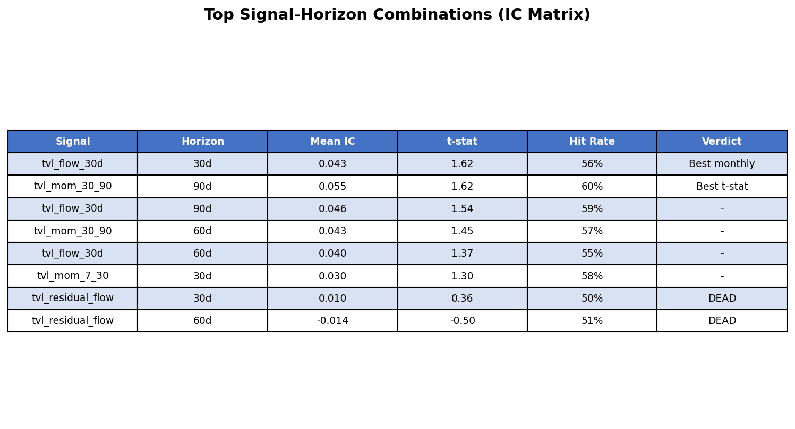
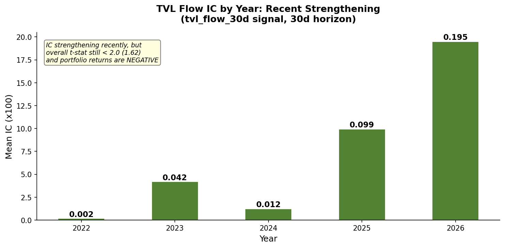
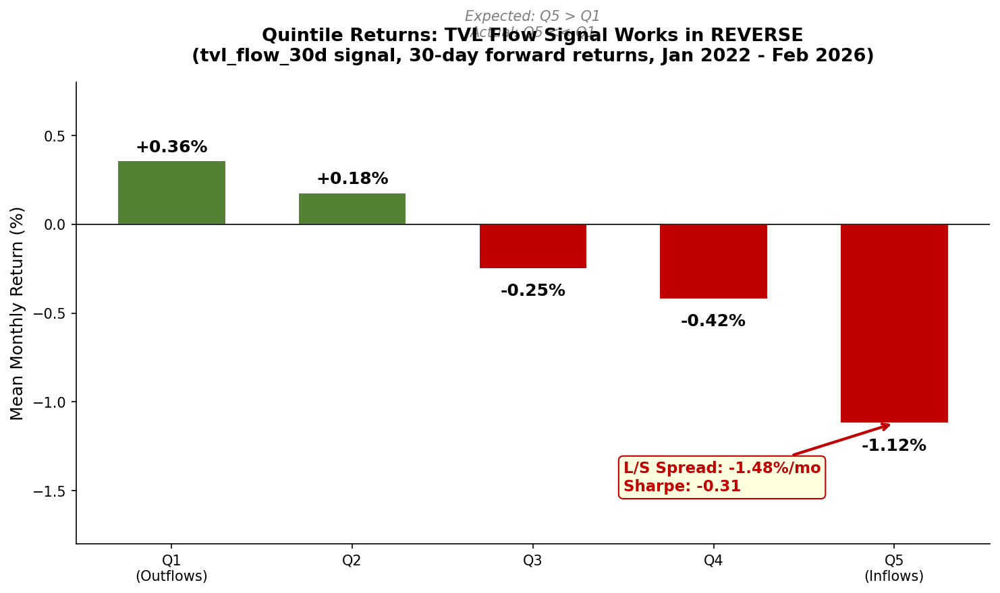
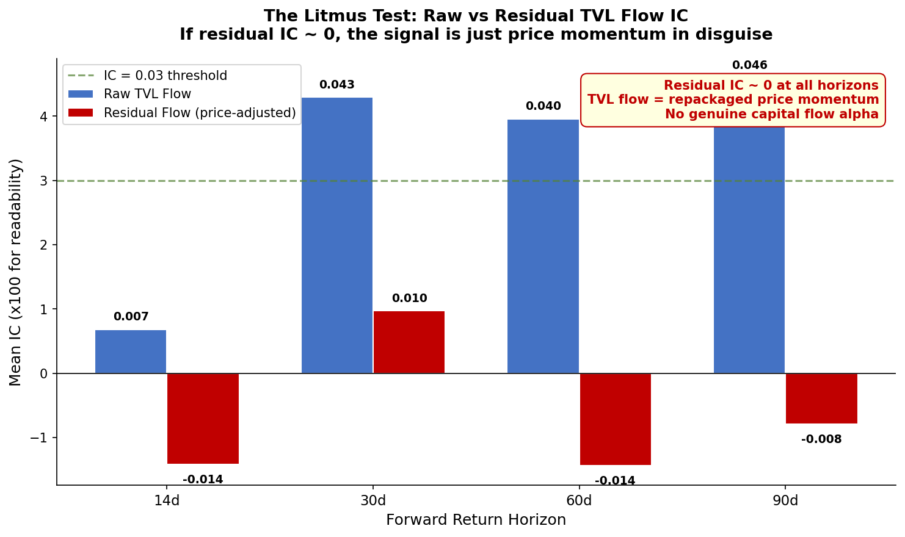
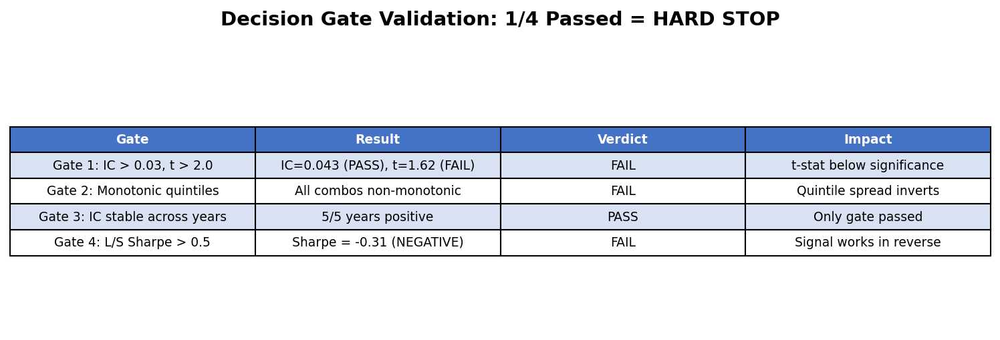

# I Tested Whether "Follow the Money" Works in Crypto. It Doesn't — The Signal Runs Backwards.

## How TVL Inflows Into Blockchain Ecosystems Predict Token Returns (in the Wrong Direction)

*I built a cross-sectional momentum strategy using on-chain capital flows across 50 blockchains. The signal had a positive Information Coefficient — but the portfolio lost money. Here's how that's possible, and what it teaches about crypto alpha.*

---

## TL;DR

- **TVL (Total Value Locked) growth into a blockchain should predict its native token appreciating** — more capital = more users = higher returns. I tested this across 50 chains over 4 years
- **The signal has a positive IC of 0.043** (rank correlation between TVL flow and forward returns), but a **t-statistic of only 1.62** — below the 2.0 significance threshold
- **Critical finding: the portfolio returns are NEGATIVE.** Going long high-inflow chains and short outflow chains produces a Sharpe of **-0.31**. The signal works *in reverse* at the portfolio level
- **Root cause: TVL flow is just crypto price momentum in disguise.** When I stripped out the price effect (residual flow), the IC collapsed to zero. There is no genuine capital flow alpha
- **Verdict: Not tradeable.** TVL flow momentum = repackaged price momentum, and crypto price momentum mean-reverts at monthly horizons

---

## Part 1: The Hypothesis — Follow the Money

In traditional finance, capital flows predict returns. When international fund managers pour money into a country's stock market, that market tends to outperform. The mechanism is straightforward: inflows push prices up, and institutional investors tend to move capital toward markets with genuinely better prospects.

I wanted to test whether the same logic works in crypto, using **Total Value Locked (TVL)** as the flow measure.

TVL measures the total capital deployed in a blockchain's DeFi ecosystem — the money sitting in lending protocols, DEXes, liquid staking, yield farms. When TVL grows on Solana, for instance, it means capital is flowing into that ecosystem. Someone, somewhere, decided Solana's DeFi opportunities were worth locking up capital for.

**The hypothesis:** Chains experiencing TVL growth (capital inflows) should see their native tokens appreciate. This creates a tradeable cross-sectional momentum signal — go long the chains attracting capital, go short the chains losing it.

**The economic reasoning was compelling:**
- TVL growth = "smart money" voting with their wallets
- Positive feedback loop: more TVL → more liquidity → better yields → more users → token appreciation
- Markets should underreact to capital flow momentum (behavioral underreaction)
- Academic research documents cross-cryptocurrency return predictability

But I had one concern from the start: **TVL mechanically includes token price changes.** If SOL doubles in price, Solana's TVL roughly doubles too, even if no new capital entered. This could mean TVL flow isn't measuring real capital flows at all — just repackaging price momentum.

I designed a specific test for this (Signal 4 below). The answer would determine whether this was genuine alpha or an artifact.

---

## Part 2: Data & Methodology

### Data Sources (All Free)

The data came from DefiLlama's free API — no $300/month Pro subscription needed:

- **Chain TVL history:** `/v2/historicalChainTvl/{chain}` — daily TVL for 300+ chains back to 2020
- **Chain metadata:** `chains.json` — maps each chain to its CoinGecko token ID
- **Token prices:** `coins.llama.fi/chart/coingecko:{id}` — daily OHLCV for chain tokens

I built a 97-chain panel with 80,284 daily observations spanning January 2020 to February 2026. After applying tradability filters (TVL > $30M median, 12+ months of history, starting January 2022), the investment universe narrowed to **50 chains per month on average** — including ETH, SOL, BNB, AVAX, ARB, OP, SUI, TRX, and others.


*Figure 1: Strategy parameters. Monthly rebalance with quintile sort across 50 blockchain chains.*

### Signal Design: 4 Variants

I designed four signal variants to test the thesis from different angles:


*Figure 2: The four TVL flow signals. Signal 4 (residual flow) is the intellectual litmus test — if it works, we have genuine alpha. If not, we're just repackaging price momentum.*

The key insight in this design is **Signal 4: Residual Flow.** Every month, I run a cross-sectional regression:

```
TVL_change(%) = alpha + beta1 * token_price_change(%) + beta2 * BTC_change(%) + epsilon
```

The residual (epsilon) captures TVL changes that *can't be explained by token price movements*. If someone deposits 1,000 ETH into Arbitrum's DeFi protocols, that's a genuine capital inflow that should show up as positive residual flow — regardless of what ETH's price did that month.

**If residual flow IC > raw flow IC → genuine capital flow alpha (thesis validated)**
**If residual flow IC ≈ 0 → just repackaged price momentum (thesis dead)**

### Portfolio Construction

- **Monthly rebalance**, quintile sort on signal values
- **Long Q1** (strongest TVL inflows), **Short Q5** (weakest/outflows)
- **BTC single-factor beta hedge** (neutralize market exposure)
- **Tiered transaction costs:** 10 bps (large caps like ETH, SOL, BNB), 20 bps (mid caps), 40 bps (small caps)

---

## Part 3: Statistical Analysis — The Numbers Look Promising... Then Don't

### IC Matrix: Weak But Positive

I tested all 16 combinations (4 signals × 4 forward return horizons):


*Figure 3: Information Coefficient heatmap. Green = positive predictive power. The raw TVL signals show modest positive ICs (0.03-0.05), but all t-statistics fall below 2.0. The residual flow row (bottom) is dead.*


*Figure 4: Top signal-horizon combinations ranked by t-statistic. Note how residual flow variants are marked "DEAD" — this is the smoking gun.*

The best combination — `tvl_flow_30d` at a 30-day horizon — produced an IC of 0.043 with a t-statistic of 1.62. In plain English: there's a modest positive rank correlation between TVL flow and forward 30-day returns, but **it's not statistically significant** at conventional thresholds.

More revealing: the **residual flow signal is effectively zero** (IC = 0.010, t = 0.36). This means once you strip out the mechanical price effect, TVL changes have zero predictive power for token returns.

### The IC Evolves Over Time


*Figure 5: Annual IC for tvl_flow_30d. The signal has strengthened recently (0.099 in 2025, 0.195 in early 2026), but the overall t-statistic across all years is still only 1.62 — insufficient evidence that this isn't noise.*

An interesting pattern: the IC was near zero in 2022-2023 but strengthened in 2024-2025. This could mean the signal is emerging, or it could mean we're seeing recent random variation in a small sample. Without a t-stat above 2.0 over the full period, I can't distinguish signal from noise.

---

## Part 4: The Reversal — When Positive IC Produces Negative Returns

This is the most important chart in this post. **It shows why a positive IC doesn't guarantee a profitable portfolio.**


*Figure 6: Average monthly returns by TVL flow quintile. Q1 = chains with the largest TVL outflows, Q5 = chains with the largest inflows. The thesis predicts Q5 > Q1. Reality: Q1 crushes Q5.*

**The signal works in complete reverse at the portfolio level:**

- **Q1 (TVL outflows):** +0.36%/month — *oversold chains bounce back*
- **Q5 (TVL inflows):** -1.12%/month — *crowded chains underperform*
- **Long/Short spread:** -1.48%/month, **Sharpe = -0.31**

Going long the chains everyone is piling into and shorting the chains people are abandoning *loses money consistently*. The contrarian trade would have worked.

### How Is a Positive IC Possible With Negative Portfolio Returns?

This is a genuine statistical paradox that I think is worth explaining, since it can trap researchers who only look at IC:

**The IC measures rank correlation across the entire cross-section.** It asks: "Does higher signal generally predict higher returns?" And the answer is a weak yes (0.043).

**But the portfolio only captures the *extremes* (Q1 vs Q5).** The quintile returns are **non-monotonic** — the relationship between signal and returns breaks down at the tails. Middle quintiles might follow the expected pattern while the extremes invert.

Think of it this way: chains with moderate TVL inflows might slightly outperform chains with moderate outflows (contributing to a positive IC), but chains with *extreme* inflows (crowded trades) underperform chains with *extreme* outflows (oversold bounces). The IC averages over the whole distribution, but the L/S portfolio lives at the extremes.

**Lesson: Always compute quintile spread returns. IC alone is not sufficient.**

---

## Part 5: The Litmus Test — Is This Just Price Momentum?


*Figure 7: The key diagnostic. Blue bars show raw TVL flow IC (positive but weak). Red bars show residual flow IC (near zero everywhere). Once you remove the token price effect, there's nothing left.*

This chart tells the whole story. The raw TVL flow signal has modest predictive power (blue bars above zero at 30d, 60d, 90d horizons). But the residual flow — TVL changes after accounting for token price movements — has essentially **zero IC at every horizon**.

**What this means:**
1. TVL flow is measuring *price momentum*, not genuine capital flows
2. When SOL goes up 30%, Solana's TVL mechanically rises ~30% too
3. The "TVL inflow" signal is really saying "this token's price went up recently"
4. Crypto price momentum *mean-reverts* at monthly horizons (well-documented)
5. Therefore: buying "high TVL flow" tokens = buying recent winners = buying into mean-reversion

This explains the quintile reversal perfectly. The signal identifies recent momentum (positive IC at the rank level), but crypto momentum reverses at 30-day+ horizons, so the extreme winners (Q5) subsequently underperform while the extreme losers (Q1) bounce back.

---

## Part 6: Decision Gate Validation

I use a formal 4-gate validation framework before proceeding to backtesting. The strategy must pass at least 3 of 4 gates:


*Figure 8: Decision gate results. Only 1 of 4 gates passed. This triggers a HARD STOP — no point running a backtest on a dead signal.*

**1 out of 4 gates passed. Hard stop.**

I could have spent another week building a walk-forward backtest engine, testing 48 robustness configurations, and computing Deflated Sharpe Ratios. But the signal validation told me everything I needed to know in 30 minutes of compute time.

**This is the value of decision gates:** they prevent you from sunk-cost-fallacy-ing your way through a doomed project.

---

## Part 7: Key Lessons Learned

### 1. TVL Mechanically Includes Token Prices — Always Decompose

This is the biggest trap in on-chain data. TVL = quantity_locked × token_price. When ETH goes up 50%, Ethereum's TVL goes up ~50% even if zero new capital entered. Any signal built on raw TVL changes is contaminated by price momentum.

**Fix:** Always compute residual flow (TVL change after regressing out price effect) before making claims about "capital flows."

### 2. Crypto Momentum Mean-Reverts at Monthly Horizons

This is well-documented but bears repeating. In equities, momentum works at 2-12 month horizons. In crypto, momentum works at 1-7 *day* horizons and then reverses. Building a monthly-rebalance momentum strategy in crypto is swimming against the current.

**Implication:** If you find a crypto signal with monthly IC > 0, check whether it's just disguised momentum. If so, the portfolio will likely show reversal at execution frequency.

### 3. Positive IC Does Not Guarantee Positive Portfolio Returns (IC Paradox)

Spearman IC measures average rank correlation across the entire cross-section. A positive IC of 0.04 means "higher signal ≈ slightly higher returns on average." But portfolios live in the tails. If the extremes don't follow the overall pattern, the L/S portfolio can lose money despite positive IC.

**Fix:** Always compute quintile spreads and check monotonicity before backtesting. IC is necessary but not sufficient.

### 4. Residual Signal Design Is Your Best Friend for Novelty Verification

In a field full of repackaged factors, the fastest way to check novelty is to residualize your signal against known factors. If the residual IC collapses to zero, you haven't found anything new — you've just found a noisy proxy for an existing factor.

I built this test into the experiment design from Day 1, and it saved me from a false positive.

### 5. Early Validation Saves Enormous Time

The previous project (DeFi Revenue Value) ran 5 full experiments before discovering the signal was fragile. This time, I applied a lesson from that failure: **test quarterly IC early, validate gates strictly, and stop when the evidence says stop.**

Result: 3 experiments instead of 5. Days of compute time saved. The rejection was clear, unambiguous, and well-documented.

---

## Part 8: Final Verdict

**Thesis: REJECTED.**

TVL flow momentum is not a viable cross-sectional alpha source for blockchain tokens. The signal is mechanically dominated by price momentum, which mean-reverts at the monthly rebalance frequency. The residual flow analysis confirms there is no genuine capital flow alpha buried underneath.

### Could a Modified Version Work?

Possibly:
- **Contrarian (reverse the signal):** Going *long* TVL outflow chains and *short* inflow chains would have been profitable. But this is a different thesis (mean reversion, not momentum), and the negative Sharpe on the forward direction (-0.31) suggests weak magnitude even for the reverse
- **Higher frequency (daily/weekly):** TVL flow at very short horizons, before the momentum reversal kicks in, might capture genuine short-term price pressure. But the data granularity and execution costs make this challenging for cross-sectional chain tokens
- **TVL composition changes:** Instead of total TVL flow, tracking which *protocols* are gaining/losing share within a chain might capture genuine innovation momentum. This is a different signal entirely

### What This Research Produced

While the trading signal failed, the project created reusable infrastructure:
- **Chain TVL pipeline:** 300 chains, free API, incremental refresh
- **Chain-to-token mapping:** 300 CoinGecko IDs mapped to blockchain names
- **Paginated price API:** 3-window approach for coins.llama.fi covering 2020-2026
- **Residual decomposition framework:** Cross-sectional regression separating price effect from genuine flows

These assets are ready for the next hypothesis.

---

## About This Research

- **Date:** February 2026
- **Period:** January 2022 - February 2026 (4 years)
- **Universe:** 50 blockchain chains with TVL > $30M and tradeable native tokens
- **Data Sources:** DefiLlama (chain TVL, free API), CoinGecko via coins.llama.fi (token prices)
- **Signals tested:** 4 TVL flow variants × 4 horizons = 16 combinations
- **Methodology:** Cross-sectional Spearman IC, quintile sort, L/S portfolio estimation

---

*Disclaimer: This research is for educational purposes only. Past performance does not guarantee future results. Always do your own due diligence before making investment decisions.*

**Tags:** #QuantitativeFinance #Crypto #DeFi #TVL #CrossSectionalMomentum #AlphaResearch #FailedStrategies
