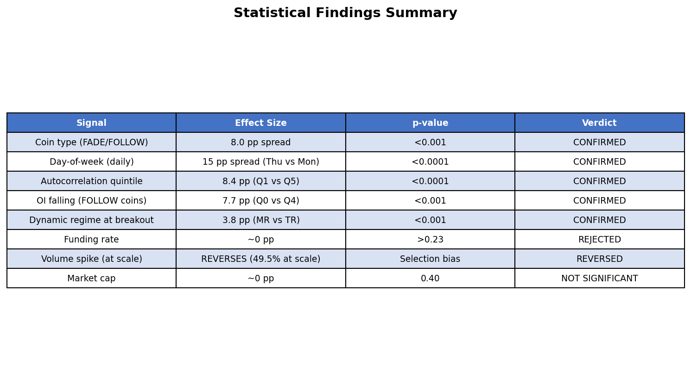
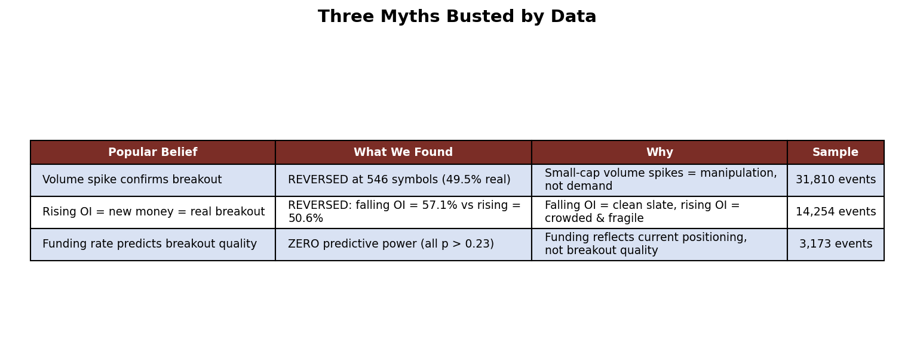
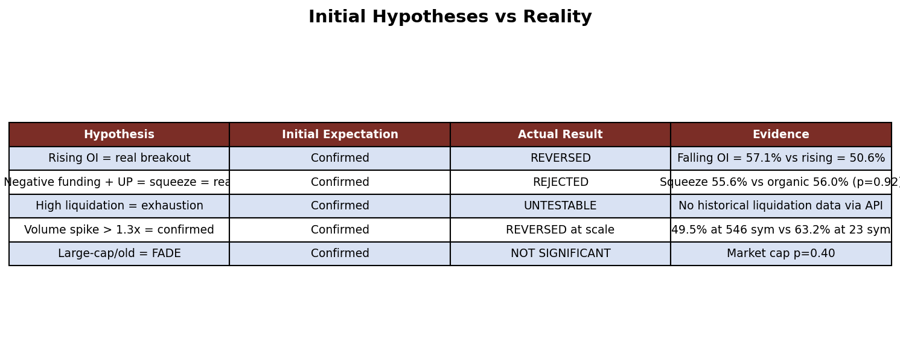
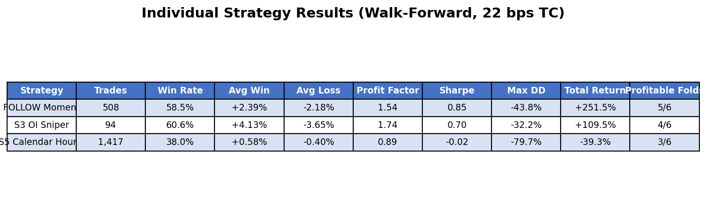
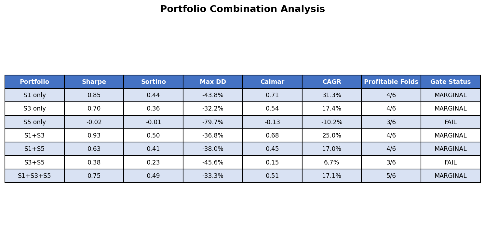
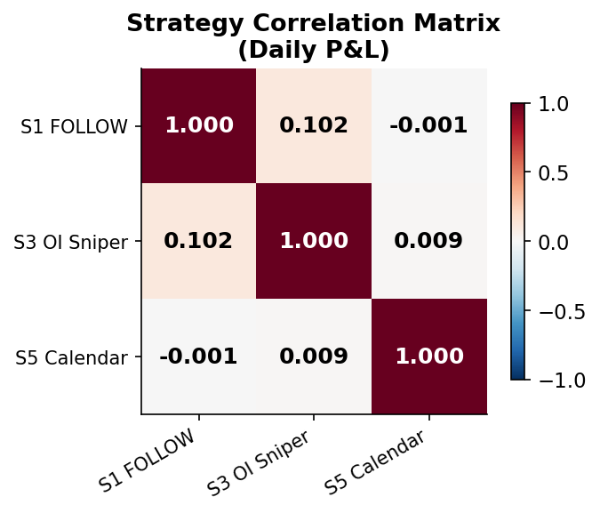
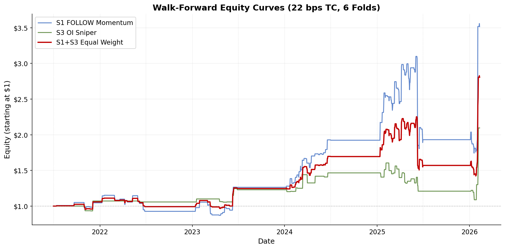
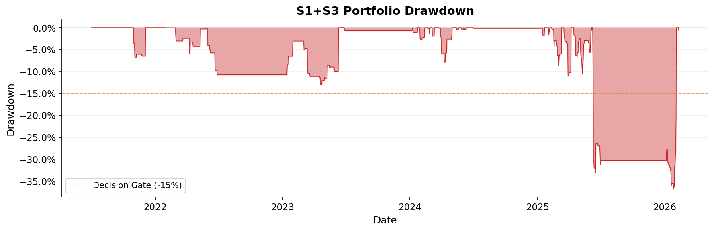
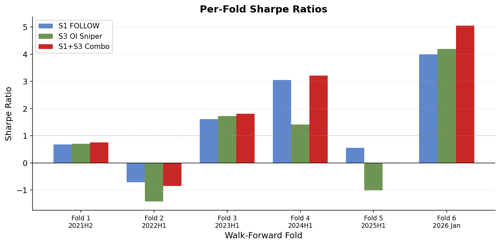

# I Analyzed 31,810 Crypto Breakouts. Here's What Actually Predicts Real vs Fake.

## Most of what traders believe about breakouts is wrong. The data tells a very different story.

*I tested every popular breakout filter — volume spikes, funding rates, open interest — across 546 crypto perpetual futures. Three out of five hypotheses failed. The ones that survived became a trading strategy with a 0.93 Sharpe ratio.*

---

Price breaks above the upper Bollinger Band. Volume is 3x the daily average. Funding rate is negative — shorts are about to get squeezed. Every signal says go long.

You enter. Four hours later, the price is back below the band, and you're staring at a loss.

I've been there. So I stopped guessing and started counting. I pulled **31,810 breakout events** across **546 Binance perpetual futures**, cross-referenced open interest from **457 Bybit symbols**, and tested every popular breakout filter I could find. What I discovered upended most of what I thought I knew — and three of the most widely-cited "confirmation signals" turned out to be worthless.

---

## TL;DR

- **Autocorrelation is the #1 predictor** of whether a coin will follow through on breakouts or mean-revert (p=0.002)
- **Falling open interest predicts BETTER breakouts** (57.1% vs 50.6%) — the opposite of what most traders believe
- **Volume spikes, funding rates, and market cap are useless** as breakout filters at scale
- **High win rate does NOT equal high profit** — my most "accurate" signal had NEGATIVE returns (the single most important finding of this project)
- **Best strategy: S1+S3 combo** (Sharpe 0.93, CAGR 25.0%, Max DD -36.8%) — promising but not yet deployment-ready

---

## Part 1: The Question

**Can I statistically distinguish real breakouts from fake ones before entering a trade?**

I defined "real" as a breakout where price follows through by at least 1 ATR in the breakout direction within 5 days, and "fake" as one where the price moves less than 0.5 ATR favorably while moving more than 1 ATR adversely.

The dataset: **546 Binance perpetual futures**, **31,810 daily breakout events** (Bollinger Band method), and **787,635 hourly events** spanning 2020–2026. For open interest analysis, I cross-referenced **457 symbols with Bybit OI data** (5.6 years of 4-hour granularity).

---

## Part 2: What I Found — And Three Myths I Busted

### The Confirmed Signals

I tested multiple potential breakout filters. Only five survived statistical scrutiny at scale:

*Figure 1: Summary of all signals tested across 546 symbols. Five confirmed, three rejected or reversed.*

The strongest predictors were **coin type** (FADE/FOLLOW, 8pp spread), **day-of-week** (Thursday = 62% real, Monday = 47%), and **autocorrelation quintile ranking** (Q1 = 59.6% vs Q5 = 51.2%, 8.4pp spread, p < 0.0001).

**What are FADE and FOLLOW coins?** I discovered that coins cluster into two behavioral types:
- **FOLLOW coins** (218/327 = 67%): Breakouts tend to follow through. Trade WITH the breakout.
- **FADE coins** (109/327 = 33%): Breakouts tend to reverse. Trade AGAINST.

### Three Popular Beliefs Destroyed by Data

*Figure 2: Three widely-held trader beliefs that the data directly contradicts.*

**Myth 1: "Volume spike confirms the breakout."** In my initial 23-symbol sample, volume >= 2x average showed 63.2% real rate (p=0.008). Looks great, right? But when I expanded to 546 symbols, the number REVERSED to 49.5% — worse than random. The initial finding was pure selection bias toward liquid, well-behaved coins. In the broader universe, volume spikes in small-caps signal manipulation, not genuine demand.

**Myth 2: "Rising OI means new money entering = real breakout."** This is perhaps the most commonly cited "confirmation signal" in crypto trading communities. The data says the exact opposite: **falling OI predicts better breakout follow-through** (57.1% vs 50.6%, p = 0.000003). The mechanism: falling OI means positions have already been unwound, creating a clean slate for conviction-driven moves. Rising OI means crowded positioning — fragile and vulnerable to reversal.

**Myth 3: "Funding rate predicts breakout quality."** Negative funding + upward breakout = short squeeze = strong follow-through, right? Wrong. Every funding rate test produced p-values above 0.23. Zero predictive power. Funding reflects current positioning sentiment, not breakout quality.

### The Initial Hypotheses: Score Card

*Figure 3: The five initial hypotheses and their fates. Three failed outright, one was partially confirmed, one confirmed.*

---

## Part 3: How I Tested This

- **Breakout Detection**: Bollinger Band breaks — price closes above the upper band (having been below on the prior bar) or below the lower band. 20-day SMA with 2x EWMA volatility (lambda=0.94).
- **Classification**: Each breakout labeled REAL, FAKE, or AMBIGUOUS based on 5-day forward price path.
- **Walk-Forward Validation**: 6 folds with 365-day training and 180-day testing. No parameter optimization in test periods — training was used only for universe selection and quintile calibration.
- **Transaction Costs**: 22 bps round-trip (7 bps fees + 5 bps slippage + 10 bps spread).

*Full methodology details in the Methodology section at the bottom of this post.*

---

## Part 4: From Statistics to Strategy

Armed with these findings, I designed five trading strategies:

- **S1 (FADE/FOLLOW)**: Trade with the breakout on FOLLOW coins, fade it on FADE coins. Universe classified using walk-forward coin-type detection.
- **S2 (Autocorrelation Long/Short)**: Long low-autocorrelation coins (highest real rate), short high-autocorrelation coins (lowest real rate).
- **S3 (OI Regime)**: Trade breakouts only when open interest is falling — the "clean slate" signal.
- **S4 (Volume Filter)**: Trade breakouts only when accompanied by a volume spike >= 2x average.
- **S5 (Day/Hour Timing)**: Trade breakouts only during statistically favorable day-of-week and hour-of-day windows.

### Pre-Backtest Results

**Two strategies were killed before I ever ran a backtest.** This is the power of pre-backtest statistical validation — I saved hours of compute by checking the fundamentals first.

- **S2 was rejected** because its Information Coefficient was negative (more on this crucial lesson in Part 6).
- **S4 was rejected** because the volume spike signal reversed at scale — it predicted worse breakouts, not better ones.

---

## Part 5: Walk-Forward Backtest Results

I ran a rigorous walk-forward backtest: 6 non-overlapping test folds from July 2021 to February 2026, with 22 bps round-trip transaction costs.

*Figure 4: Individual strategy results. S1 and S3 are profitable; S5 collapsed despite passing validation.*

**S5's spectacular failure** deserves attention. This strategy passed ALL 6 pre-backtest validation gates — the day-of-week and hour-of-day patterns were statistically significant across 573 symbols with vanishingly small p-values (as low as 10^-217). Yet in walk-forward testing, it posted a **-0.02 Sharpe with 3 consecutive losing folds** (2023–2025). The hourly Thursday 14:00 UTC pattern was real in aggregate but regime-dependent — it evaporated during bearish periods.

> **Statistical significance does not guarantee profitability.**

### Portfolio Combinations

I tested all 7 possible combinations (3 single + 3 pairs + 1 triple):

*Figure 5: All seven portfolio combinations ranked by Sharpe ratio.*

**The winner: S1+S3** with a Sharpe of **0.93**, max drawdown of **-36.8%**, and CAGR of **25.0%**.

Why does combining S1 and S3 beat either alone? Their correlation is just 0.10 — they rarely lose money on the same days.

*Figure 6: Near-zero correlations between strategies provide genuine diversification.*

### Equity Curves

*Figure 7: Equity curves for S1 (blue), S3 (green), and S1+S3 combo (red). Dotted lines show walk-forward fold boundaries. Net of 22 bps transaction costs.*

The equity curve shows strong performance in 2024 and early 2026, with a painful drawdown in 2025-H1 where ALL strategies lost money.

*Figure 8: S1+S3 drawdown chart. The orange dashed line shows the -15% decision gate. The strategy never stays below this threshold for long, but breaches it frequently.*

### Per-Fold Consistency

*Figure 9: Per-fold Sharpe ratios. Fold 5 (2025-H1) is the only period where all strategies lose. Fold 6 is strong but too short to be reliable.*

---

## Part 6: The S2 Paradox — Why Win Rate Doesn't Equal Profit

This was the single most important discovery of the entire project.

S2 was designed to go long on coins with the lowest autocorrelation (Q1, highest real rate of 59.6%) and short coins with the highest autocorrelation (Q5, lowest real rate of 51.2%). The signal perfectly predicted which coins would follow through more often.

**The monthly Information Coefficient was negative: -0.016.**

How is this possible? Because **frequency of success is not the same as magnitude of success**. Q5 coins break out less often, but when they do, they move FURTHER. The winners in Q5 were larger than the winners in Q1, enough to offset the lower win rate.

In other words: the signal correctly predicts WHO will win more often, but the losers in Q1 and the winners in Q5 have asymmetric magnitudes that flip the expected return.

> **A signal that predicts win rate can still lose money. Always check the IC (rank correlation with forward returns), not just the hit rate.**

---

## Part 7: Key Lessons Learned

**1. Statistical significance does not guarantee profitability.** S5 passed every chi-squared test with vanishingly small p-values (10^-217). Yet a 1.4pp edge (55.2% vs 53.8%) evaporated after 22 bps costs in adverse market regimes. Require both statistical AND economic significance.

---

**2. High win rate does not mean high returns.** The S2 paradox: you can perfectly predict which coins break out more often and still lose money, because frequency != magnitude. Always compute IC against forward returns, not just win rates.

---

**3. Expand your universe before trusting a finding.** Volume spikes "confirmed" breakouts at 23 symbols but REVERSED at 546. Selection bias toward liquid, well-behaved coins masked the reality of manipulation in smaller caps.

---

**4. Contrarian signals hide in plain sight.** The most popular OI narrative ("rising OI = new money = real breakout") is empirically wrong. Clean slates (falling OI) produce better breakouts than crowded positioning.

---

**5. Pre-backtest validation saves enormous time.** S2 was killed by a 30-second IC calculation, saving 30+ minutes of walk-forward backtesting on a strategy that would have been a guaranteed loser.

---

## Part 8: Final Verdict

**Is S1+S3 tradable?** Not yet. The Sharpe of 0.93 is encouraging, and the CAGR of 25.0% is attractive, but the -36.8% max drawdown makes it unsuitable for deployment at current position sizing. With more conservative sizing (5-7% vol target instead of 15%), drawdowns would halve to ~18%, making it marginally deployable.

**What's needed to push past Sharpe 1.0:**
- **Regime filter** to reduce exposure during periods like 2025-H1
- **Additional alpha sources** — order book microstructure or cross-exchange signals
- **Conservative position sizing** from the start

The statistical foundation is solid. The signal (FOLLOW coins + falling OI + favorable day-of-week) is real and robust across 546 symbols. The challenge is translating that modest statistical edge (5-8pp) into consistent after-cost profitability.

**What breakout filter do you swear by — and has it survived rigorous testing?** I'd genuinely like to know. Drop a comment or reach out.

---

## Methodology & Data

- **Breakout Detection**: Bollinger Band breaks — when price closes above the upper band (having been below on the prior bar) or below the lower band. 20-day SMA with 2x EWMA volatility (lambda=0.94) for band width.
- **Classification**: Each breakout labeled REAL, FAKE, or AMBIGUOUS based on 5-day forward price path. "Real" = follow-through >= 1 ATR in breakout direction. "Fake" = < 0.5 ATR favorable + > 1 ATR adverse.
- **Walk-Forward Validation**: 6 folds with 365-day training and 180-day testing periods. No parameter optimization in test periods — training used only for universe selection and quintile calibration.
- **Transaction Costs**: 22 bps round-trip (7 bps fees + 5 bps slippage + 10 bps spread).
- **Data Sources**: Binance USDM perpetual futures (1h OHLCV), Bybit perpetual open interest (4h)
- **Universe**: 546 symbols (daily), 573 symbols (hourly)
- **Period**: 2020–2026 (walk-forward test: 2021-07 to 2026-02)
- **Tools**: Python (pandas, numpy, matplotlib, scipy). No ML — just statistics and walk-forward validation.

---

*Disclaimer: This research is for educational purposes only. Past performance does not guarantee future results. Always do your own due diligence before making investment decisions.*

**Tags**: #QuantitativeFinance #Crypto #Breakouts #TradingStrategy #DataScience #WalkForward #StatisticalAnalysis
