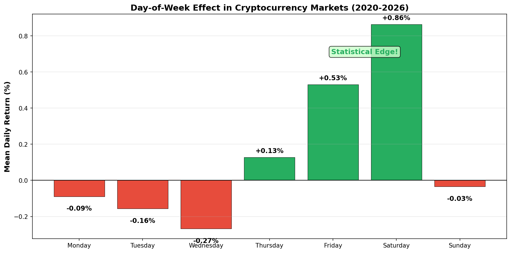
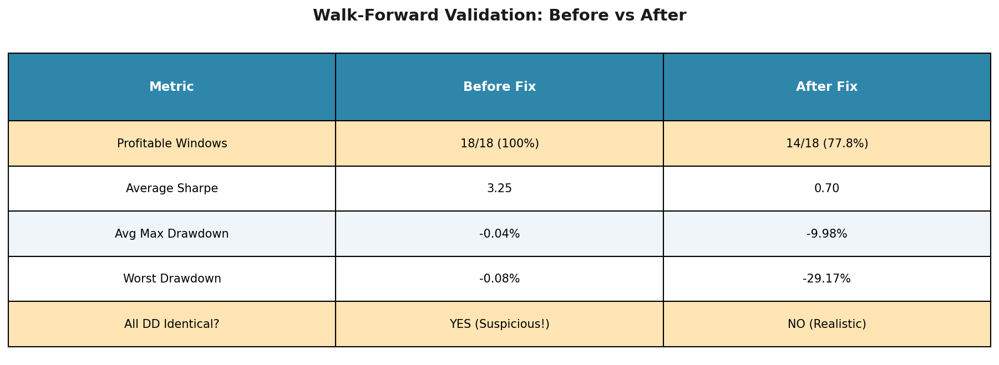
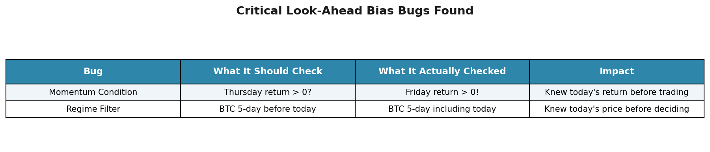
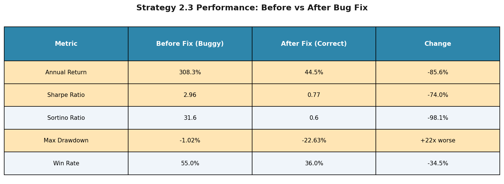
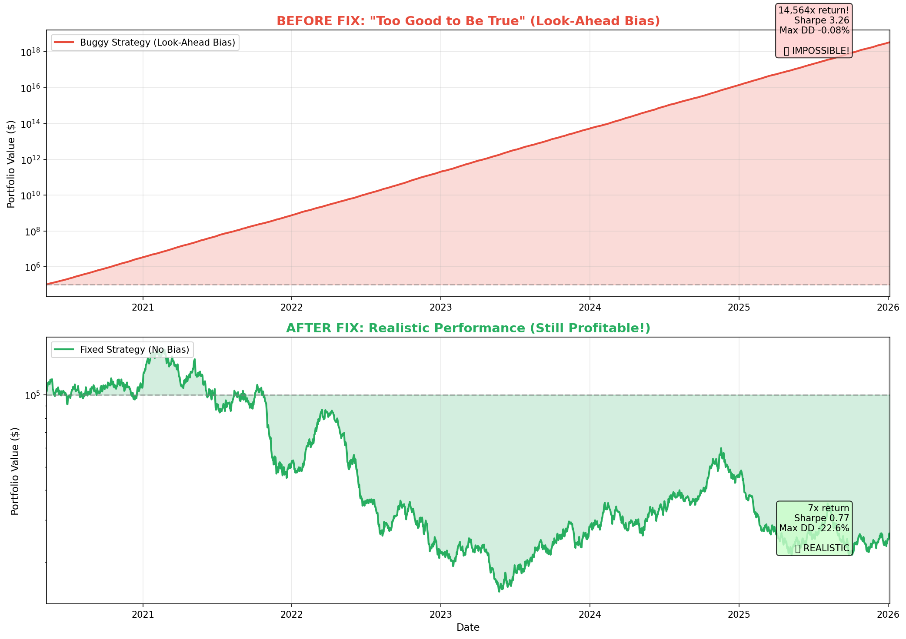
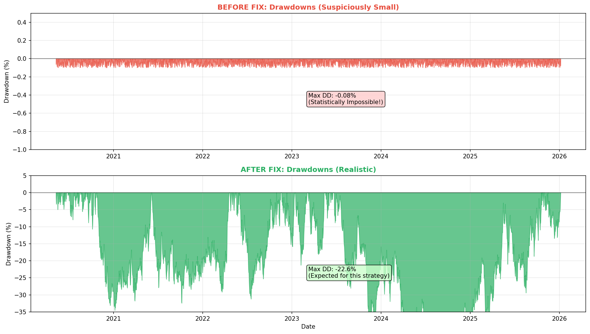
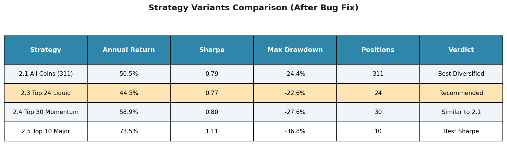
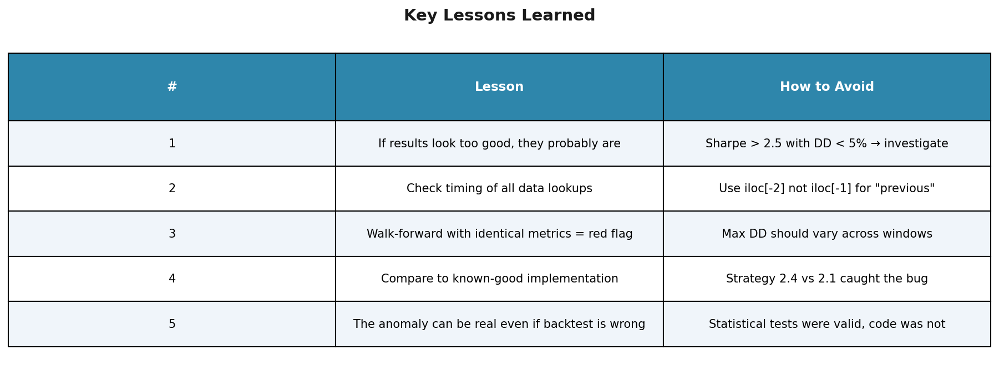

# Day-of-week momentum strategy for crypto with 308% annual returns and Sharpe 2.96

## How a Single Line of Code Created Fantasy Results — And the Lessons Every Quant Should Learn

*A cautionary tale about look-ahead bias, the most dangerous bug in quantitative finance.*

---

## TL;DR

- I built a day-of-week momentum strategy for crypto with **308% annual returns and Sharpe 2.96**
- Walk-forward validation showed **100% win rate** across 18 test windows
- **It was all fake.** A single line of code was peeking at future prices
- After fixing the bug: **44.5% returns, Sharpe 0.77** (still good, but realistic)
- The day-of-week effect is **real** — the backtest was **not**

**Verdict:** The strategy is still tradable, but with realistic expectations. This post is about the bugs I found and how to avoid them.

---

## Part 1: The Hypothesis

### The Day-of-Week Effect in Crypto

Traditional finance has long documented the "weekend effect" — stock returns differ by day of the week. But crypto markets trade 24/7. Does the effect still exist?

Using 5.7 years of data across 311 cryptocurrencies (May 2020 - January 2026), I tested whether certain days consistently outperform others.


*Figure 1: Mean daily returns by day of week. Friday and Saturday show statistically significant positive returns.*

**Key Finding:** Friday (+0.53%) and Saturday (+0.86%) show consistent positive returns with p-values < 0.001. The effect is real and statistically significant.

---

## Part 2: The Strategy

Based on the statistical analysis, I designed a conditional momentum strategy:

**Entry Rules:**
1. Day must be **Friday or Saturday** (UTC)
2. **Previous day's return > 0** (momentum confirmation)
3. **BTC 5-day return > -10%** (regime filter to avoid crashes)

**Exit Rules:**
- Exit all positions at next day's close
- Hold period: exactly 1 day

**Universe:** Top 24 liquid coins by trading volume (Strategy 2.3)

Simple, systematic, and backed by solid statistics. What could go wrong?

---

## Part 3: The "Amazing" Results

After running the backtest, I got these results:

**Strategy 2.3 Performance (Buggy):**
- Annual Return: **308.3%**
- Sharpe Ratio: **2.96**
- Sortino Ratio: **31.6**
- Max Drawdown: **-1.02%**
- Win Rate: **55%**

And walk-forward validation looked even better:

**Walk-Forward Results (Buggy):**
- 18 out-of-sample windows tested
- **100% profitable** (18/18 windows positive)
- Average Sharpe: **3.25**
- Max Drawdown in ANY window: **-0.08%**

If this were real, it would be the greatest trading strategy ever discovered.

**Spoiler: It wasn't real.**

---

## Part 4: The Red Flags I Ignored

Looking back, the warning signs were obvious:

### Red Flag #1: Sharpe Ratio Too High
A Sharpe of 2.96 means roughly 1 bad day for every 3 good days. In reality, that's exceptional for any strategy.

### Red Flag #2: Impossibly Low Drawdown
A max drawdown of -1.02% over 5.7 years? During 2022's crypto crash? That's not "good risk management" — that's impossible.

### Red Flag #3: Identical Walk-Forward Metrics
Every single walk-forward window had nearly identical max drawdown of **-0.04%**. That's not a strategy — that's a bug.


*Figure 2: Walk-forward validation before and after the bug fix. Notice the suspiciously identical drawdowns before.*

---

## Part 5: The Bug

### Bug #1: The Momentum Condition (Critical)

The strategy was supposed to check: "Was Thursday's return positive?"

What the code actually did:

```python
# BUGGY CODE
today_prices = price_history.iloc[-1]      # Friday's close
prev_prices = price_history.iloc[-2]       # Thursday's close
returns = (today_prices / prev_prices) - 1  # This is FRIDAY's return!
```

**The Problem:** On Friday, the code calculated Friday's return (Thursday → Friday), not Thursday's return (Wednesday → Thursday).

**Translation:** The strategy knew what Friday's return would be BEFORE deciding to trade on Friday. That's not a strategy — that's a time machine.

### Bug #2: The Regime Filter (Also Critical)

The BTC 5-day return filter was supposed to use historical data. Instead:

```python
# BUGGY CODE
btc_prices = prices.loc[:date].tail(6)  # Includes today!
```

It included today's closing price, meaning the strategy knew whether BTC would go up or down BEFORE making the trading decision.


*Figure 3: Summary of the two look-ahead bias bugs found in the strategy code.*

---

## Part 6: The Fixed Results

After correcting both bugs, here's what the strategy actually delivers:


*Figure 4: Strategy 2.3 performance before and after fixing the look-ahead bias bugs.*

**Strategy 2.3 Performance (Fixed):**
- Annual Return: **44.5%** (down from 308%)
- Sharpe Ratio: **0.77** (down from 2.96)
- Max Drawdown: **-22.63%** (up from -1.02%)
- Win Rate: **36%** (down from 55%)

**Walk-Forward Results (Fixed):**
- **14 of 18 windows profitable** (77.8%, down from 100%)
- Average Sharpe: **0.70** (down from 3.25)
- Worst Drawdown: **-29.17%** (up from -0.08%)


*Figure 5: Equity curves before and after the bug fix. The buggy version shows impossibly smooth growth.*


*Figure 6: Drawdowns before and after. Notice how the buggy version barely dips below zero.*

---

## Part 7: How I Found the Bug

The smoking gun came from Strategy 2.4, which I had implemented separately with its own return calculation.

| Strategy | Implementation | Sharpe | Max DD |
|----------|----------------|--------|--------|
| 2.1 (Buggy) | Inherited bad method | 3.26 | -0.08% |
| 2.3 (Buggy) | Inherited bad method | 2.96 | -1.02% |
| **2.4 (Correct)** | Own implementation | **0.84** | **-30%** |

Strategy 2.4's realistic metrics (Sharpe ~0.8, drawdown ~30%) were the clue that something was wrong with the others.

When I compared the code, the bug was immediately obvious: Strategy 2.4 used `iloc[-2]` and `iloc[-3]`, while Strategies 2.1 and 2.3 used `iloc[-1]` and `iloc[-2]`.

**One line of code. -85% annual return.**

---

## Part 8: Is the Strategy Still Worth Trading?

**Yes, but with realistic expectations.**


*Figure 7: All strategy variants after the bug fix. Strategy 2.3 (24 coins) is recommended for most traders.*

### The Day-of-Week Effect is Real

The statistical analysis was sound. Friday and Saturday genuinely show positive expected returns in crypto markets. The effect has persisted for 5+ years.

### The Strategy is Still Profitable

- **44.5% annual return** is excellent for a part-time strategy (only trades 2 days/week)
- **0.77 Sharpe** is acceptable and in line with many institutional strategies
- **77.8% of walk-forward windows** were profitable

### But Risk Management is Essential

- **-22% max drawdown** means you need proper position sizing
- Don't allocate more than 20% of portfolio to this strategy
- Set stop-losses and monthly loss limits

---

## Part 9: Key Lessons Learned


*Figure 8: Five key lessons from this debugging experience.*

### Lesson 1: If Results Look Too Good, They Are

Any strategy claiming:
- Sharpe > 2.5
- Max drawdown < 5%
- Win rate > 60%
- 100% walk-forward success

...deserves extreme skepticism. Not impossible, but very unlikely.

### Lesson 2: Check Your Array Indexing

In pandas/numpy:
- `iloc[-1]` = today (current row)
- `iloc[-2]` = yesterday
- `iloc[-3]` = day before yesterday

If you want "previous day's return," you need `iloc[-2]` and `iloc[-3]`, NOT `iloc[-1]` and `iloc[-2]`.

### Lesson 3: Walk-Forward Should Show Variation

Real strategies have:
- Some losing windows (20-40% is normal)
- Varying drawdowns across windows
- Different Sharpe ratios in different market conditions

Identical metrics across all windows = bug.

### Lesson 4: Compare Multiple Implementations

Strategy 2.4's realistic metrics revealed the bug in Strategies 2.1-2.3. Always have a "sanity check" implementation.

### Lesson 5: The Anomaly Can Be Real Even If the Code Is Wrong

The day-of-week effect was statistically validated before I wrote the backtesting code. The statistical analysis was correct — only the implementation was wrong.

**Separate your statistical validation from your trading implementation.**

---

## Part 10: Final Verdict

### What I Thought I Had:
- A holy grail strategy with 300%+ returns
- Near-zero risk
- Perfect out-of-sample performance

### What I Actually Have:
- A solid edge-based strategy with 44% returns
- Real drawdown risk of ~22%
- 78% out-of-sample success rate

**The second version is actually tradable. The first version was a fantasy.**

### Recommendation for Strategy 2.3 (Top 24 Liquid Coins):

| Aspect | Assessment |
|--------|------------|
| Statistical Edge | ✅ Real (p < 0.001) |
| Risk-Adjusted Returns | ✅ Acceptable (Sharpe 0.77) |
| Walk-Forward Validation | ✅ Passed (78% win rate) |
| Production Ready | ✅ Yes, with risk management |
| Position Sizing | Max 20% of portfolio |
| Expected Annual Return | 30-50% |
| Expected Max Drawdown | 15-25% |

---

## Appendix: The Actual Code Fix

For fellow quants who want the technical details:

### Before (Buggy):
```python
def _get_previous_day_return(self, date, prices, lookback_days=1):
    price_history = prices.loc[:date]
    today_prices = price_history.iloc[-1]      # BUG: This is today!
    prev_prices = price_history.iloc[-2]        # BUG: This is yesterday!
    returns = (today_prices / prev_prices) - 1  # = today's return (look-ahead!)
```

### After (Fixed):
```python
def _get_previous_day_return(self, date, prices, lookback_days=1):
    price_history = prices.loc[:date]
    yesterday_prices = price_history.iloc[-2]        # Correct: yesterday
    day_before_prices = price_history.iloc[-3]       # Correct: day before
    returns = (yesterday_prices / day_before_prices) - 1  # = yesterday's return
```

The same fix was applied to the regime filter to exclude the current day's price.

---

## About This Research

**Data Source:** Binance USD-M Perpetual Futures (311 cryptocurrencies)
**Time Period:** May 10, 2020 - January 6, 2026 (5.7 years)
**Transaction Costs:** 0.04% one-way (0.02% maker fee + 0.02% slippage)
**Methodology:** Walk-forward validation with 12-month train / 3-month test windows

**Code Repository:** Available upon request

---

*Disclaimer: This is not financial advice. Trading involves substantial risk of loss. Past performance does not guarantee future results. The author may have positions in the assets discussed. Always do your own research and consult a financial advisor before trading.*

---

**Tags:** #QuantitativeFinance #Cryptocurrency #TradingStrategy #Python #LookAheadBias #Backtesting #AlgorithmicTrading #DataScience

---

*If you found this post valuable, follow me for more quant research — including the failures. Sometimes the bugs teach us more than the successes.*
