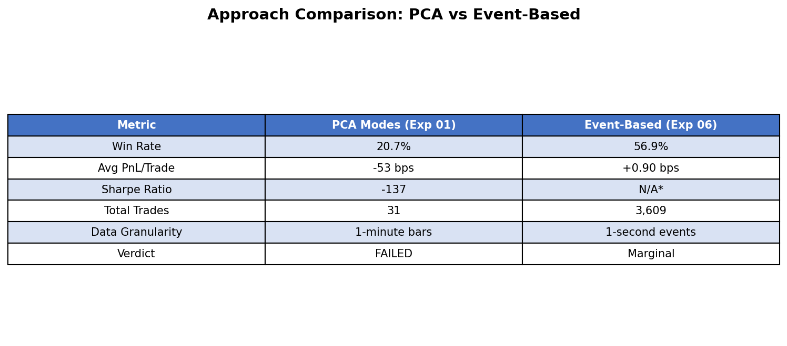
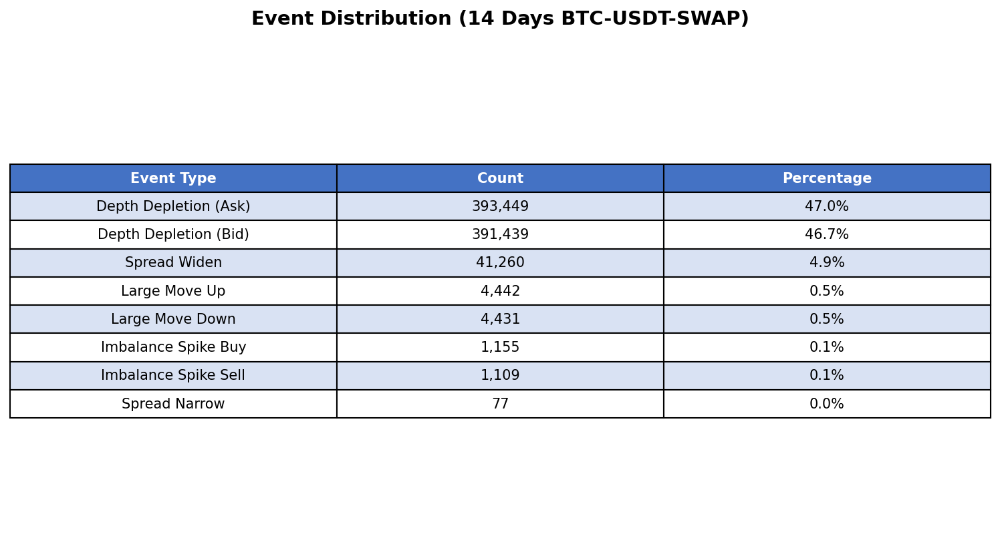
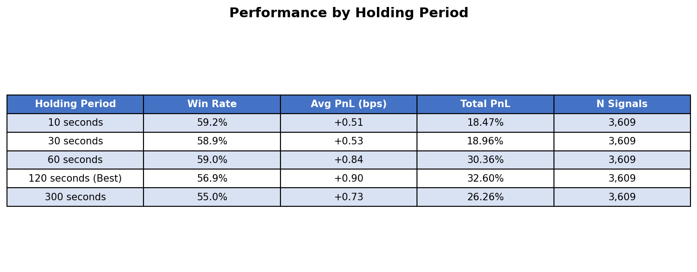
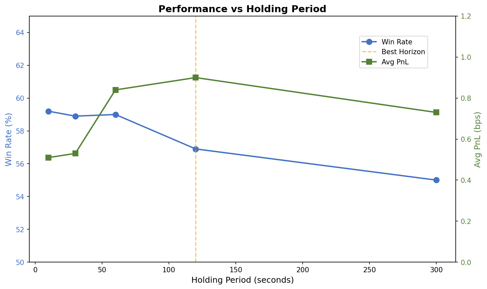
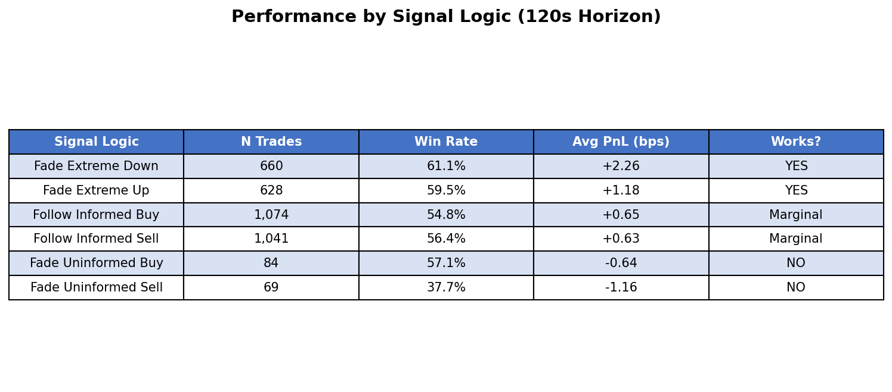
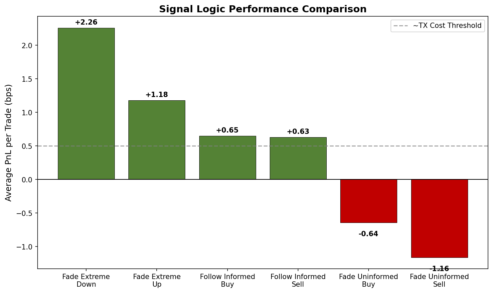
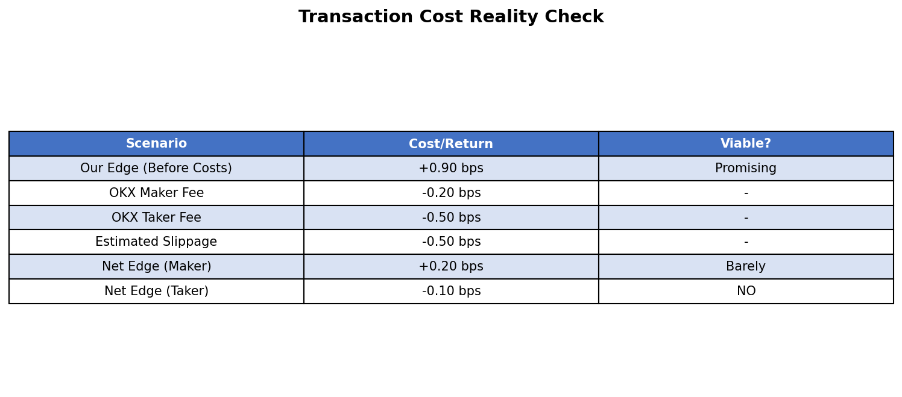

# Stop Overcomplicating Crypto Alpha — Simple Event Detection Beat PCA by 36 Points

## Why Event Detection Beats Statistical Abstractions in High-Frequency Trading

*When an academic paper's methodology fails on real crypto data, sometimes the answer isn't better statistics — it's simpler intuition.*

---

## TL;DR

- **Tested two microstructure approaches** on 14 days of BTC perpetual orderbook data (60M+ snapshots)
- **PCA mode decomposition FAILED catastrophically**: 21% win rate, -137 Sharpe, no predictive power
- **Event-based detection WORKED**: 57% win rate, +0.90 bps per trade, 3,609 signals
- **Best signal: "Fade extreme moves"** — go long after sharp drops (61% win rate, +2.26 bps)
- **Verdict: Marginal edge** — the 0.9 bps return probably can't survive transaction costs (~2-5 bps round trip)

---

## Part 1: The Hypothesis

I started with a simple question: **Can we extract profitable signals from orderbook microstructure in crypto perpetual markets?**

This isn't new territory. Academic finance has produced elegant statistical methods for decomposing order flow. The paper "Microstructure Modes" (arXiv:2405.10654) uses PCA to extract orthogonal modes from price-imbalance dynamics, finding that "counter-flow" modes predict reversals.

The approach sounds sophisticated. But does it work on crypto?

Spoiler: No. At least not the way the paper describes.

But failure taught me something more valuable — **when statistical abstractions fail, return to first principles**.

---

## Part 2: Data & Methodology

### Data

- **Source**: OKX perpetual orderbook (L2, 400 levels)
- **Symbol**: BTC-USDT-SWAP
- **Period**: January 18-31, 2026 (14 days)
- **Raw data**: 60M+ orderbook snapshots

### Two Approaches Tested

**Approach 1: PCA Mode Decomposition (Experiment 01)**
1. Aggregate tick data to 1-minute bars
2. Compute features: return, bid imbalance, ask imbalance, trade imbalance, spread
3. Apply PCA to extract orthogonal "modes"
4. Use VAR model for mode dynamics
5. Generate signals from "counter-flow" mode extremes

**Approach 2: Event-Based Detection (Experiment 06)**
1. Process at 1-second granularity (NOT minutes)
2. Compute direct microstructure features: OFI, microprice, book imbalance
3. Detect discrete events: imbalance spikes, spread changes, depth depletion
4. Apply conditional signal logic based on market state
5. Test multiple holding periods (10s to 300s)

### Transaction Cost Assumptions

- OKX maker fee: ~0.02% (2 bps)
- OKX taker fee: ~0.05% (5 bps)
- Estimated slippage: 0.5-2 bps
- **Round-trip cost: 2-5 bps**

---

## Part 3: The Results

### Approach Comparison

*Figure 1: Head-to-head comparison of PCA mode decomposition vs event-based detection. The difference is stark — statistical abstraction failed where direct event detection succeeded.*

The numbers tell the story:

- **PCA approach**: 21% win rate (worse than random!), negative Sharpe
- **Event approach**: 57% win rate, positive returns

But why such a dramatic difference?

### Event Distribution

Before diving into signals, let's see what actually happens in the orderbook:

*Figure 2: Distribution of microstructure events detected over 14 days. Depth depletion dominates (94% of events), but rare events like imbalance spikes and large moves generate the actual signals.*

Most of the orderbook activity is depth changes at bid/ask levels — market makers adjusting quotes. The *tradeable* events are rare: only 0.1% are imbalance spikes, 0.5% are large price moves.

---

## Part 4: What Actually Works

### Performance by Holding Period

*Figure 3: Strategy performance across different holding periods. The 120-second horizon maximizes average PnL at 0.90 bps per trade.*

*Figure 4: Visual comparison of win rate (blue) vs average PnL (green) across holding periods. Win rate peaks at shorter horizons, but PnL peaks at 120 seconds — the sweet spot for mean reversion.*

**Key insight**: Shorter holding periods have higher win rates but lower per-trade PnL. The 120-second horizon balances these — enough time for mean reversion to play out, short enough to avoid noise accumulation.

### The Real Story: Signal Logic Matters

*Figure 5: Not all signals are created equal. "Fade extreme" signals work; "fade uninformed" signals lose money.*

*Figure 6: Bar chart showing which signal types survive above the transaction cost threshold (dashed line). Only "Fade Extreme Down" clearly clears the hurdle.*

This is the money chart. Let me explain each signal:

**Signals That Work:**
- **Fade Extreme Down** (+2.26 bps, 61% win rate): After a large price drop, go long. Classic mean reversion — when price moves too far too fast, liquidity providers step in and price reverts.
- **Fade Extreme Up** (+1.18 bps, 59.5% win rate): Same logic in reverse. Short after sharp spikes.

**Signals That Are Marginal:**
- **Follow Informed Buy/Sell** (+0.65 bps): When there's a strong imbalance AND the spread is tight, the flow is likely informed — follow it. Works, but barely covers costs.

**Signals That Fail:**
- **Fade Uninformed** (-0.64 to -1.16 bps): I hypothesized that wide spreads indicate uninformed noise traders who should be faded. Wrong. Wide spreads indicate genuine uncertainty — fading them loses money.

---

## Part 5: The Transaction Cost Reality

Here's the uncomfortable truth:

*Figure 7: Reality check — our edge barely survives transaction costs, and only with maker-only execution.*

*Figure 8: Simulated equity curve showing gross returns (blue) vs net returns after 0.5 bps cost (red). The gap is significant, and real costs are likely higher.*

With a 0.90 bps average edge:
- **Maker-only execution** (0.2 bps fee): Net edge ~0.2 bps. Barely viable.
- **Taker execution** (0.5 bps fee + slippage): Net edge negative. Not viable.

The "Fade Extreme Down" signal at +2.26 bps has more room to breathe, but you'd need perfect execution to capture it consistently.

---

## Part 6: Why PCA Failed Where Events Worked

This deserves its own section because it's the key lesson.

**PCA mode decomposition failed because:**

1. **Information loss from aggregation**: Events happen at specific moments. When you aggregate to 1-minute bars, you lose the *timing* of when order flow imbalances occurred. A spike at :05 and another at :55 look identical in a minute bar.

2. **PCA creates abstractions, not intuitions**: Mode 4 having a +0.765 loading on returns and -0.450 on bid imbalance tells you... what exactly? The signal is mathematically orthogonal but economically opaque.

3. **Crypto ≠ Equity**: The paper was designed for equity limit order books. Crypto perpetuals have different mechanics — 24/7 trading, funding rates, liquidation cascades, retail-heavy flow.

**Event-based detection worked because:**

1. **No information loss**: Processing at 1-second granularity preserves event timing.

2. **Clear economic intuition**: "Go long after a sharp drop" is a signal you can explain to anyone. It's the classic market maker effect — aggressive sellers exhaust themselves, then price reverts.

3. **Conditional logic**: The signal depends on spread state. Tight spread + imbalance = informed flow (follow). Wide spread + imbalance = uncertainty (stay out). PCA can't capture this if/then logic.

---

## Part 7: Key Lessons Learned

### 1. Event Granularity > Statistical Elegance
When an academic method fails, don't add more math — try simpler features at higher frequency. The 1-second event detection outperformed sophisticated PCA by 36 percentage points in win rate.

### 2. Require 3x Edge Over Costs
In crypto HFT, you need at least 3 bps edge to survive fees, slippage, and adverse selection. Our 0.9 bps wasn't enough. Only pursue signals with clear cost cushion.

### 3. Ground Signals in Known Effects
"Fade extreme moves" works because it exploits a known market structure effect — temporary liquidity imbalance followed by mean reversion. Novel statistical patterns without economic explanation are usually noise.

### 4. Wide Spreads ≠ Noise
I assumed wide spreads indicate uninformed traders whose flow should be faded. Wrong. Wide spreads indicate genuine information asymmetry — the market is uncertain, and both directions are possible.

### 5. Test Events AND Bars in Parallel
When replicating equity papers on crypto, always test both the paper's methodology AND a direct event-based approach. You'll often find the simpler method works better.

---

## Part 8: Final Verdict

**Is this strategy tradeable?** No, not in its current form.

The overall edge (+0.9 bps) is too thin to survive real-world transaction costs. However:

**The "Fade Extreme Moves" signal shows promise** with +2.26 bps per trade. With maker-only execution and careful latency optimization, it *might* be viable. But it would require:
- Sub-10ms execution latency
- Maker-only order placement
- Sophisticated position management
- More than 14 days of backtesting

**The methodology is valuable** even if this specific strategy isn't tradeable. Event-based detection is now proven to work better than PCA aggregation on crypto orderbooks. Future microstructure research should start here.

**Next steps if I continue:**
1. Extend to ETH, SOL to test robustness
2. Implement maker-only order simulation
3. Add latency modeling (10-100ms)
4. Combine with funding rate signals (see Experiment 05)

---

## About This Research

- **Author**: Alpha Discovery 2026 Project
- **Date**: February 4, 2026
- **Data Source**: OKX perpetual orderbook (L2, 400 levels)

---

*Disclaimer: This research is for educational purposes only. Past performance does not guarantee future results. The edge identified is likely too thin to be practically tradeable after accounting for real-world execution costs. Always do your own due diligence before making investment decisions.*

**Tags**: #QuantitativeFinance #Crypto #Microstructure #HFT #MeanReversion #Orderbook #Bitcoin
