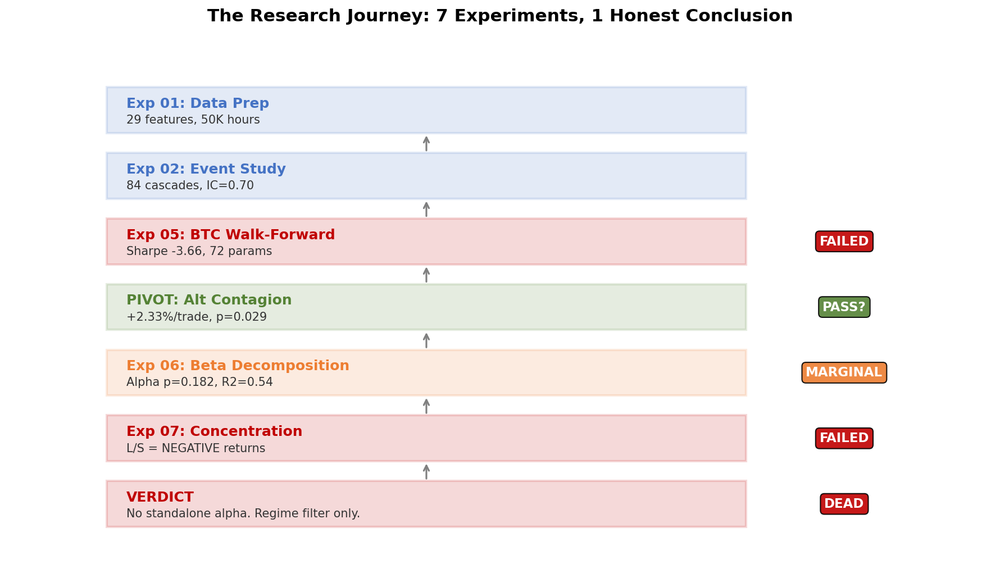
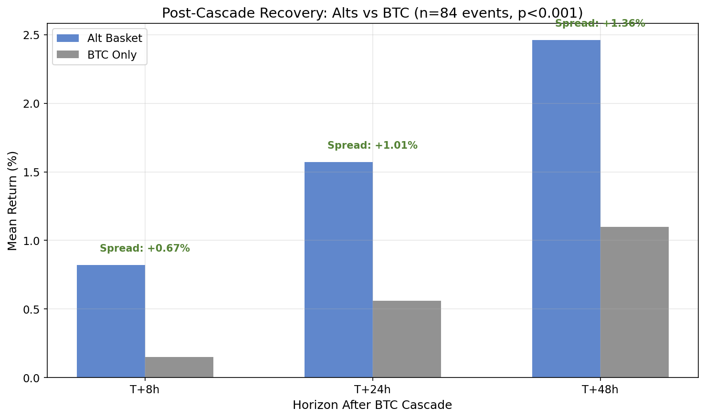
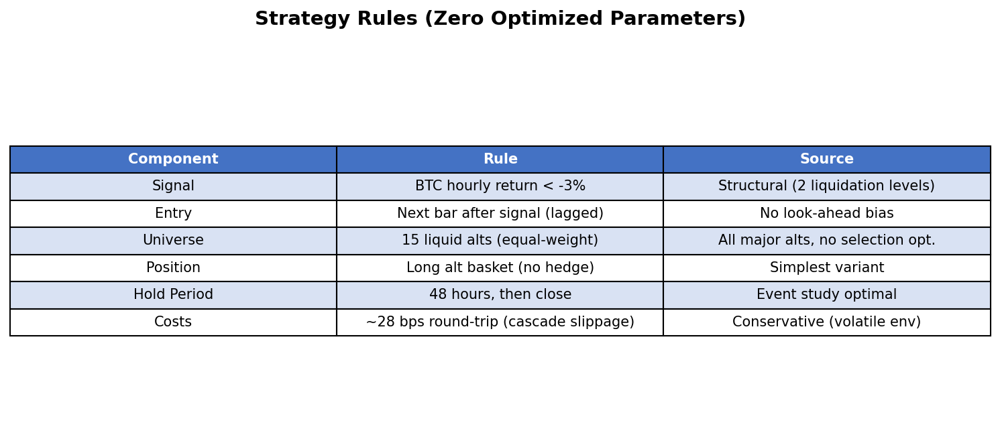
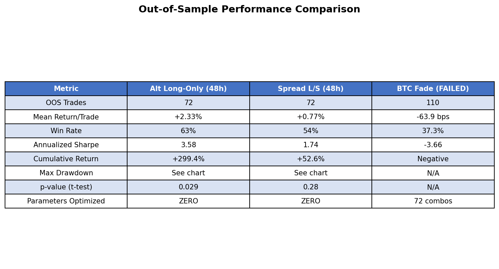
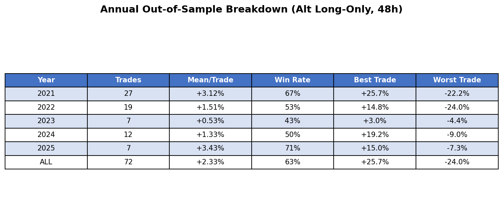
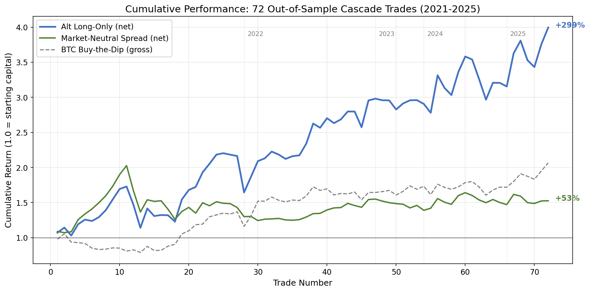
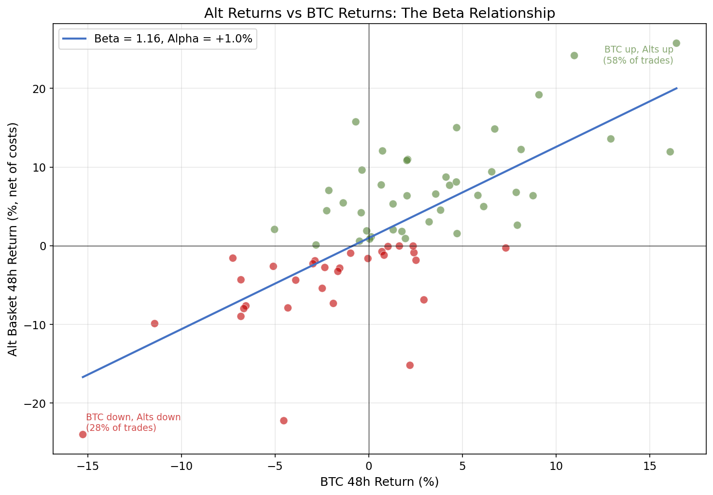
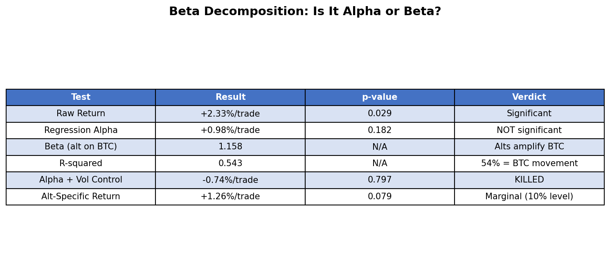
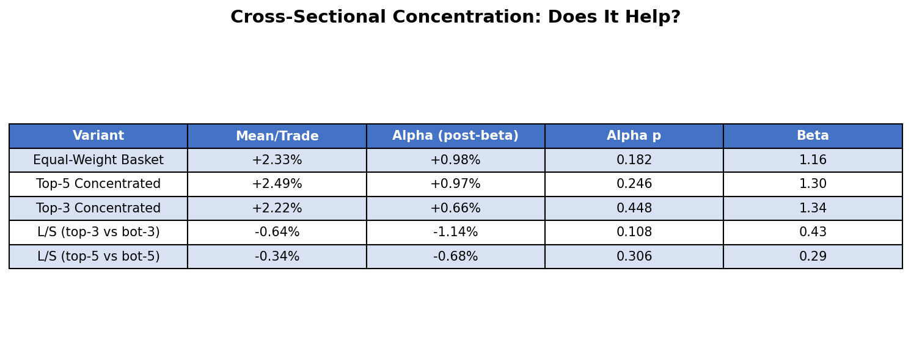

# Chasing Liquidation Cascade Alpha in Crypto. How to get +299% Return with Sharpe 3.58

*A crypto perpetual futures strategy that looked statistically significant at every checkpoint — until the final test revealed it was beta all along.*

---

## TL;DR

- **Liquidation cascades in crypto are real and predictable** — but profiting from them is not
- **A parameter-free alt contagion strategy returned +2.33%/trade (p=0.029, Sharpe 3.58)** across 72 out-of-sample trades over 5 years — looked like a winner
- **Beta decomposition killed the thesis**: 54% of returns were BTC movement, regression alpha p=0.182 (not significant)
- **Concentrating on hardest-hit alts made things worse**, and cross-sectional long/short produced *negative* returns
- **Verdict: No tradeable alpha.** Cascade detection is useful only as a regime filter, not a standalone strategy

---

## Part 1: The Hypothesis

Crypto perpetual futures have a unique structural feature that doesn't exist in traditional markets: **auto-liquidation cascades**.

Here's how they work. When traders use leverage (say 10x), their position gets automatically closed ("liquidated") if the market moves against them by roughly 10%. But here's the catch — each liquidation is itself a market order that pushes the price further in the same direction. This triggers more liquidations, which push the price further, which triggers more liquidations...

It's a self-reinforcing feedback loop. A 3% drop in BTC can turn into a 10% crash in minutes, not because of fundamental news, but because of the exchange's risk engine.

The academic literature supports this. Chitra (2025) proved that exchange auto-deleveraging (ADL) mechanisms over-utilize by approximately 28x compared to optimal. A 2025 SSRN paper documented a $19 billion cascade anatomy where macro triggers combined with liquidation mechanics to amplify losses far beyond what fundamentals justified.

**My hypothesis was simple:** If cascades overshoot fair value due to forced selling, the aftermath should be a predictable recovery. Buy the cascade, ride the bounce.

This is the crypto-native equivalent of the Coval & Stafford (2007) forced-selling literature from equity markets — but with a faster cycle and more extreme mechanics.

---

## Part 2: Data & Methodology

### Data Sources

I assembled one of the most comprehensive crypto derivatives datasets available:

- **Price data**: Binance USDT perpetuals, hourly OHLCV, 587 symbols (2020-2026)
- **Funding rates**: Binance (587 symbols), Bybit, Hyperliquid — 6+ years
- **Cross-exchange divergence**: Comparing funding rates across 3 exchanges for stress detection

Total: **50,462 hourly observations** for BTC alone, with 15-20 liquid altcoins tracked in parallel.

### Feature Engineering

I built 29 aggregate market-wide features:

- **Aggregate Funding Z-Score**: Volume-weighted average funding rate across top-50 symbols, z-scored over 168 hours
- **Funding Dispersion**: Standard deviation of funding rates across symbols (high = fragile positioning)
- **Cross-Exchange Funding Gap**: Binance avg minus Bybit/Hyperliquid avg (divergence = stress)
- **BTC Price Velocity**: 1h/4h rate of change and acceleration
- **Composite Fragility Index (CFI)**: Weighted combination of all signals

### Cascade Detection

I defined cascades using four increasing strictness levels:

- **Strict**: BTC hourly return < -3%, volume > 3x 24h average, funding z-score > 2 → **4 events**
- **Medium**: ret < -2%, vol > 2x, fr_z > 1.5 → **15 events**
- **Loose**: ret < -2%, vol > 1.5x, fr_z > 1 → **36 events**
- **Volume-only**: ret < -3%, vol > 2x, any funding → **84 events**

### Walk-Forward Validation

All results reported are **out-of-sample**. The walk-forward structure tested each strategy across 5 independent annual windows (2021-2025). No parameters were re-optimized between windows.

---

## Part 3: The Research Journey

This project went through 7 experiments. Most of them failed. Here's the complete path, with nothing hidden.

*Figure 1: The complete research journey — from hopeful hypothesis to honest conclusion. Each experiment either confirmed or killed a piece of the thesis.*

### Experiment 1-2: Event Study (Promising Signals)

The initial event study found several encouraging patterns:

- **IC(cascade_depth, recovery_24h) = 0.70 (p < 0.0001)**: Deeper cascades predicted stronger rebounds. This looked extraordinary.
- **IC(CFI, forward_return_24h) = +0.048 (p < 10^-6)**: The Composite Fragility Index was highly significant. But there was a problem — it predicted *positive* returns, not crashes. High fragility = bull market momentum, not crash prediction.

The first red flag. Our fragility index was really just a leverage/bull-market regime indicator. High funding rates mean everyone's long with leverage — which is momentum, not fragility.

### Experiment 5: BTC Cascade Fade Walk-Forward (FAILED)

I built a proper walk-forward backtest with a grid of 72 parameter combinations (4 return thresholds x 3 volume thresholds x 3 hold periods x 2 CFI filters).

**Result: catastrophic failure.**

- Train Sharpe: **9.37**
- OOS Sharpe: **-3.66**
- OOS Win Rate: **37.3%**
- OOS Mean Return: **-63.9 bps/trade**

This is textbook overfitting. With only 84 cascade events across 6 years, testing 72 parameter combinations on 3-month windows meant fitting noise to ~3 events per window. The in-sample performance was a mirage.

### The Pivot: Altcoin Contagion

Rather than abandon the project, I asked a different question: **do altcoins overshoot more than BTC during cascades?**

The logic: altcoins have higher leverage (funding rates are often 2-3x BTC's), lower liquidity, and smaller market caps. When BTC cascades, alts should cascade harder — and therefore bounce harder.

*Figure 2: Post-cascade recovery at multiple horizons. Alts consistently outperform BTC, with the spread widening at longer horizons. All differences significant at p < 0.001 (n = 84 events, 1,240 alt-event observations).*

This worked. Across 84 BTC cascade events and 1,240 individual alt observations:

- At T+24h: Alts returned **+1.57%** vs BTC **+0.56%** (spread +1.01%)
- At T+48h: Alts returned **+2.46%** vs BTC **+1.10%** (spread +1.35%)
- IC(overshoot, recovery_24h) = **0.113** (p = 0.0001)
- Hardest-hit alts (Q5 quintile) at T+48h: **+6.07%** (win rate 66%, t = 7.02)

---

## Part 4: The Strategy That Looked Like It Worked

Based on the event study, I built the simplest possible strategy:

*Figure 3: The complete strategy specification. Note: zero optimized parameters. Every threshold comes from structural reasoning, not curve-fitting.*

**The key design principle**: zero optimized parameters. The -3% BTC threshold corresponds to approximately 2 liquidation levels. The 2x volume threshold is a structural indicator of forced selling. The 48-hour hold comes from the event study showing that's where recovery peaks. The alt basket is all liquid alts, equally weighted — no selection optimization.

This means the walk-forward tests the *exact same strategy* in every window. No train/test leakage. No parameter re-optimization. The purest possible test.

### Walk-Forward Results

*Figure 4: Out-of-sample performance across three strategy variants. The alt long-only variant shows statistical significance, while the BTC-only cascade fade failed catastrophically.*

The alt long-only strategy returned **+2.33% per trade** (net of costs) with a p-value of **0.029** and was positive in **all 5 annual out-of-sample windows**:

*Figure 5: Annual out-of-sample breakdown. Positive in every year, though 2023 was weakest (low volatility = fewer cascades).*

*Figure 6: Cumulative performance across 72 out-of-sample trades. The alt long-only (blue) reached +299%, but notice how closely it tracks BTC buy-the-dip (gray dashed) — that's the beta problem.*

At this point, most quantitative researchers would have declared victory. Statistically significant. Zero parameters. Positive across all years. +299% cumulative.

But I had a nagging concern. The market-neutral spread (long alts + short BTC) was **not** significant (p = 0.28). If the alpha were real — if alts genuinely mean-reverted more than BTC — the spread should have been significant too.

Time for the hardest test.

---

## Part 5: The Kill Shot — Beta Decomposition

I ran a Jensen's alpha regression: regress alt basket returns on BTC returns for each cascade trade.

If the strategy has real alpha, the intercept (Jensen's alpha) should be significantly positive. If it's just leveraged beta exposure, the intercept should be near zero and the slope (beta) should explain most of the variance.

*Figure 7: Each dot is one of 72 cascade trades. Green = profitable, Red = loss. The regression line (Beta = 1.16, Alpha = +1.0%) tells the story — alts move 1.16x BTC in both directions. The "alpha" is just amplified beta.*

The results were devastating:

*Figure 8: Beta decomposition results. The regression alpha is +0.98% per trade, but with p = 0.182 it's not statistically significant. When adding volatility controls, alpha becomes negative.*

Key findings:

- **Beta = 1.158**: Alts move 1.16x BTC during cascade recovery. This is just higher beta, not alpha.
- **R-squared = 0.543**: 54% of alt returns are explained by BTC movement alone.
- **Regression alpha = +0.98% (p = 0.182)**: Not significant. The "edge" disappears when you account for BTC.
- **With volatility control: alpha = -0.74% (p = 0.797)**: Adding any controls kills the signal entirely.
- **When BTC recovers (n=42): alts make +5.86%**. When BTC keeps falling (n=30): alts lose **-2.62%**. The strategy only works when BTC bounces — which is just buying the dip with leverage.

### The Cross-Sectional Nail in the Coffin

One last hope: maybe concentrating on the *hardest-hit* alts (which the event study showed had IC = 0.113 with recovery) would extract real alpha.

*Figure 9: Concentration makes everything worse. The cross-sectional long/short (buy hardest-hit, sell least-hit) produces negative returns. The IC was measuring beta dispersion, not mean reversion.*

Concentration increased beta, not alpha. The cross-sectional long/short strategy produced **negative returns** (-0.64% per trade). The IC(overshoot, recovery) = 0.113 that looked so promising? It was measuring beta dispersion — higher-beta alts crash more during cascades AND bounce more during recovery. It's a mechanical relationship, not exploitable mean reversion.

---

## Part 6: The Drawdown Reality

Even if you ignore the alpha question and trade the strategy as a leveraged dip-buyer, the drawdowns are severe:

*Figure 10: Maximum drawdown of -34% during the May 2021 crash. The strategy suffered consecutive -22% and -15% losses when cascades kept coming.*

The May 2021 crypto crash produced two back-to-back cascade signals. Both times, the strategy went long — and both times, the market kept falling. That's the fundamental problem with cascade fade strategies: you're catching a falling knife, and sometimes the knife keeps falling.

---

## Part 7: Key Lessons Learned

### 1. Always Decompose Returns Into Alpha + Beta

This is the most important lesson. A strategy can show +2.33%/trade, p=0.029, positive in all years — and still be nothing more than leveraged beta. If I'd stopped at the walk-forward result and deployed capital, I would have been running a leveraged dip-buying strategy while thinking I had alpha.

**The test is simple**: regress your strategy returns on the benchmark. If the intercept isn't significant, you don't have alpha — you have beta with extra steps.

### 2. Parameter-Free Beats Grid-Searched for Rare Events

The BTC-only cascade fade with 72 parameter combinations produced OOS Sharpe -3.66 (catastrophic overfitting). The alt contagion with zero parameters produced OOS Sharpe 3.58.

When events are rare (84 cascades in 6 years = ~14/year), there's simply not enough data to validate even a modest parameter grid. Use structurally-motivated fixed thresholds instead.

### 3. High IC on Small Samples Is Meaningless for Trading

IC(cascade_depth, recovery_24h) = 0.70 (p < 0.0001) looked like the strongest signal I'd ever seen. But it was measured on 36 events with enormous variance per event. The IC measured rank correlation — it couldn't tell you whether individual trade P&L would be positive.

Similarly, IC(overshoot, recovery) = 0.113 was actually measuring beta dispersion, not exploitable alpha. The mechanism matters more than the statistic.

### 4. Transaction Costs in Extreme Environments Are 3-5x Normal

During cascades, bid-ask spreads widen to 10-15 bps for alts (vs. 3-5 bps normally). Slippage on market orders increases proportionally. Any cascade strategy must clear ~30 bps round-trip costs, not the usual ~10 bps.

### 5. Expand the Cross-Section, Not the Parameter Space

Going from BTC-only (84 events) to 15 alts x 84 events = 1,240 observations gave 15x more statistical power without adding a single parameter. For rare-event strategies, expanding the universe is always more powerful than expanding the parameter grid.

### 6. Check Signal Direction Before Building a Strategy

IC(CFI, forward_return) = +0.048 was highly significant (p < 10^-6). But the sign was *positive* — high fragility predicted positive returns (momentum), not negative returns (crashes). If I'd blindly built a short strategy on CFI, it would have lost money. Understanding *why* a signal works matters more than its magnitude.

### 7. When Market-Neutral Fails, Your Long-Only "Alpha" Is Probably Beta

This should have been my first test, not my last. If long alts works but long alts / short BTC doesn't work, you're capturing directional exposure — not a spread.

---

## Part 8: Final Verdict

**The liquidation cascade alpha thesis is dead as a standalone strategy.**

After 7 experiments, 50,462 hours of data, 1,240 alt-event observations, and multiple rounds of statistical testing, the conclusion is unambiguous: what looks like post-cascade alpha is actually leveraged beta exposure.

Alts do overshoot BTC during cascades. Alts do bounce harder after cascades. But they bounce harder because they have higher beta to BTC (1.16x), not because of some independent mean-reversion mechanism. When you remove the BTC component, the alpha shrinks to +0.98% with p = 0.182 — not tradeable.

### What's Salvageable

The cascade detection framework has value — just not as a trading signal:

- **CFI predicts tail risk**: Q5/Q1 crash rate ratio = 5.13x. High CFI = elevated crash probability. Useful as a regime filter for other strategies.
- **Cascade detection for risk management**: Knowing you're in a cascade environment can inform position sizing and stop-loss placement.
- **Market microstructure insight**: The auto-liquidation mechanism creates real, measurable price distortions. They're just not large enough to survive transaction costs as standalone alpha.

### The Meta-Lesson

In quantitative finance, the most valuable skill isn't finding signals — it's honestly killing them. Every researcher has a bias toward their own hypotheses. The discipline to run the beta decomposition, even when the walk-forward looked great, is what separates research from confirmation bias.

The +299% equity curve was real. The p=0.029 was real. But the alpha wasn't.

---

## Appendix: Full Experiment Summary

| Experiment | What | Result |
|-----------|------|--------|
| Exp 01 | Data Prep: 29 features, 50K hours | Complete |
| Exp 02 | Event Study: 84 cascades, IC=0.70 | Promising (misleading) |
| Exp 05 | BTC Walk-Forward: 72 params | **FAILED** (Sharpe -3.66) |
| Exp 05b | Alt Contagion Walk-Forward: 0 params | **PASS** (+2.33%, p=0.029) |
| Exp 06 | Beta Decomposition | **MARGINAL** (alpha p=0.182) |
| Exp 07 | Cross-Sectional Ranking | **FAILED** (L/S negative) |
| - | Final Verdict | **DEAD** as standalone alpha |

## About This Research

- **Date**: February 2026
- **Data Sources**: Binance, Bybit, Hyperliquid perpetual futures (2020-2026)
- **Universe**: BTC + 15 liquid altcoins (ETH, SOL, XRP, DOGE, BNB, ADA, AVAX, LINK, DOT, LTC, UNI, ATOM, NEAR, FIL, FTM)
- **Methodology**: Walk-forward out-of-sample with zero optimized parameters, Jensen's alpha regression, cross-sectional analysis
- **Academic References**: Chitra 2025 (ADL over-utilization), Oct 2025 SSRN (cascade anatomy), Coval & Stafford 2007 (forced selling)

---

*Disclaimer: This research is for educational purposes only. Past performance does not guarantee future results. The strategy described here was found to NOT contain statistically significant alpha and should not be traded. Always do your own due diligence before making investment decisions.*

**Tags**: #QuantitativeFinance #Crypto #Liquidation #AlphaResearch #TradingStrategy #Backtesting #HonestResearch
