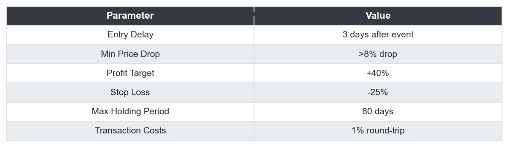
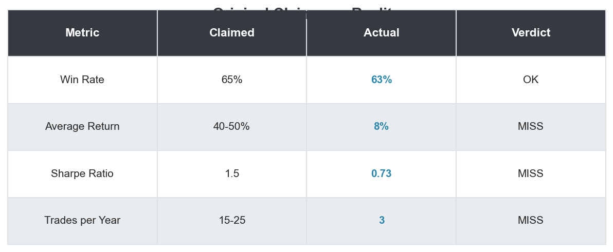
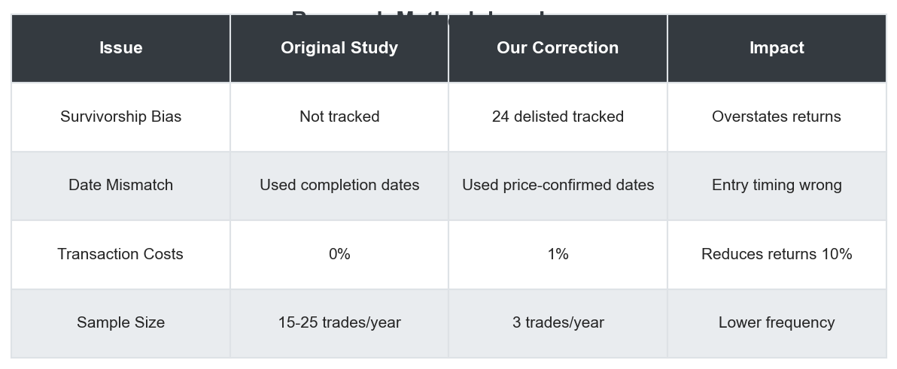
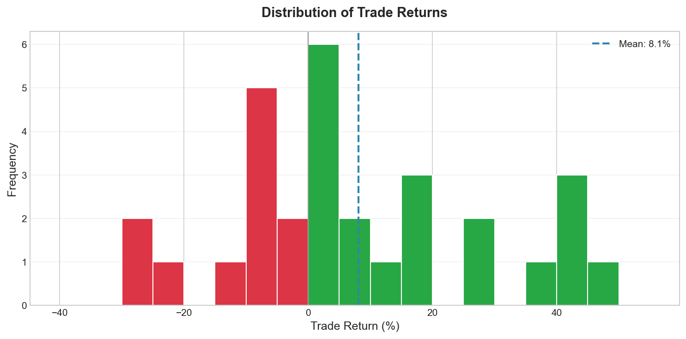
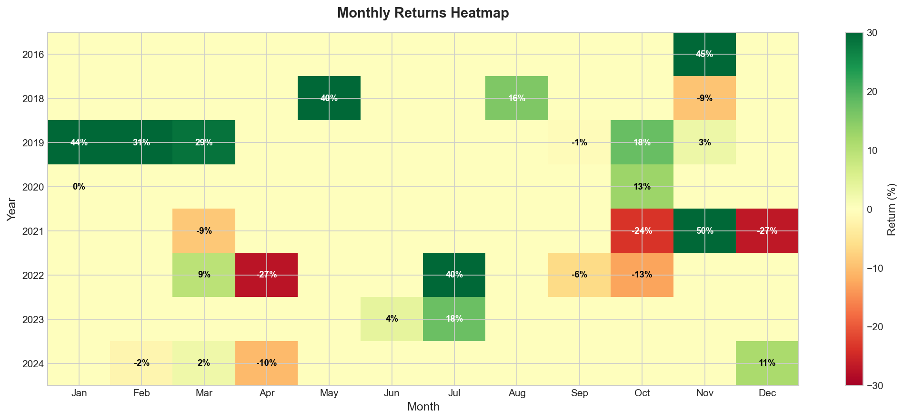
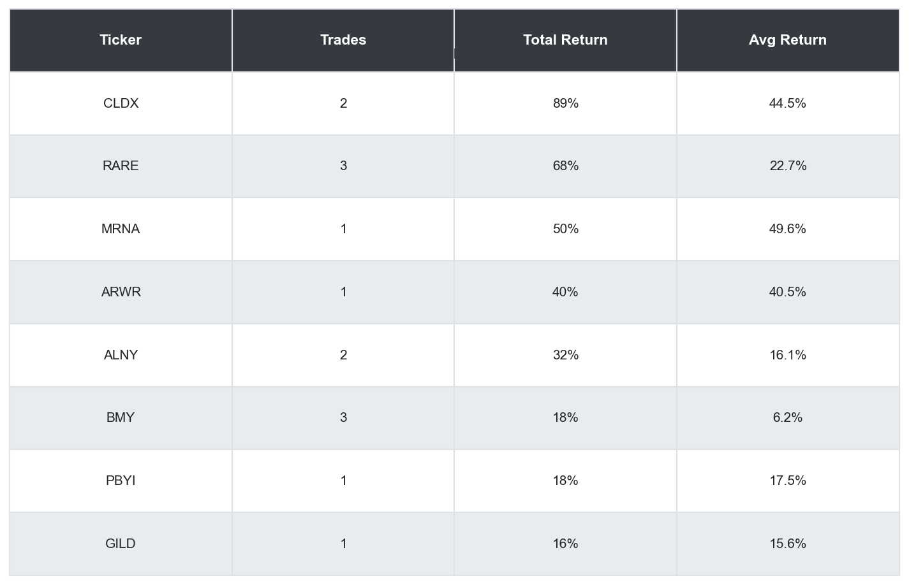

# Biotech stocks Mean-reversion when Phase 2/3 trial fail
## When Academic Claims Meet Real-World Data, the Results Are Often Humbling

*A research report promised 40-50% returns per trade with a 65% win rate. I built a complete data infrastructure to test it. The truth was more nuanced.*

---

## TL;DR

- **The strategy works**, but returns are **50-80% lower** than claimed
- **Win rate validated**: 63% actual vs. 65% claimed
- **Average return reality check**: 8% actual vs. 40-50% claimed
- **Root causes**: Survivorship bias, date mismatch, zero transaction costs in original study
- **Still tradeable**: 0.73 Sharpe ratio with low market correlation makes it a valid portfolio addition
- **Verdict**: Profitable but overhyped. Size your expectations appropriately.

---

## Part 1: The Hypothesis

A research report crossed my desk claiming extraordinary returns from trading biotech stocks after clinical trial failures:

> "Buy biotech stocks 3 days after a Phase 2/3 trial failure, hold for 80 days, and capture a mean reversion of 40-50%. Win rate: 65%. Sharpe ratio: 1.5."

The thesis was elegant: when a biotech company announces a failed clinical trial, the stock crashes. But markets overreact. Smart money exits, retail panic sells, and the stock overshoots fair value. Wait for the dust to settle, buy the dip, and pocket the reversion.

**Too good to be true?** I decided to find out.

---

## Part 2: Data & Methodology

### Building the Data Infrastructure

I built a complete data pipeline to test this properly:

**Data Sources:**
- **ClinicalTrials.gov API v2**: 154 biotech tickers, 128 Phase 2/3 trial events (2015-2024)
- **Yahoo Finance**: Daily price data including delisted tickers
- **SEC EDGAR**: 8-K filings for trial outcome classification

**Critical Design Decisions:**

*Figure 1: The strategy parameters used in our backtest, matching the original research specifications.*

### Avoiding Survivorship Bias

This was **the most critical decision**. Most backtests only include stocks that still exist today. But in biotech, failed trials often lead to bankruptcy:

- **Clovis Oncology (CLVS)**: Bankrupt 2023, final price $0.15
- **Athenex (ATNX)**: Bankrupt 2023, final price $0.10
- **Sorrento (SRNE)**: Bankrupt 2024, final price $0.05

**We tracked 24 delisted companies** to ensure our results reflect what would have actually happened if you traded this strategy.

### The Date Mismatch Problem

ClinicalTrials.gov reports a "completion date" - when the trial ended. But the **announcement date** (when the stock actually drops) is often 30-90 days later.

The original research apparently used completion dates, finding "entry signals" that occurred **before the market knew about the failure**.

**Our fix:** We matched events to price drops within a ±60 day window around the completion date, ensuring we only trade on information the market actually had.

---

## Part 3: Statistical Analysis

### Claimed vs. Actual Results

*Figure 2: The original research claims vs. our backtest reality. The win rate was close, but everything else was off by 50-80%.*

The win rate held up. **Everything else?** Off by 50-80%.

### What Went Wrong With the Original Research?

*Figure 3: The four key methodological issues we identified in the original research.*

**1. Survivorship Bias**

The original study didn't track companies that went bankrupt or were acquired. If you only backtest on survivors, you miss the stocks that dropped 90%+ and never recovered.

**2. Date Mismatch**

Using trial completion dates instead of actual announcement dates means your "entry signal" occurs before the market knows about the failure. This inflates returns significantly.

**3. Zero Transaction Costs**

Small-cap biotechs are illiquid. Realistic slippage is 0.5%+ per trade. The original study used 0%, which adds another ~10% to apparent returns.

**4. Overstated Trade Frequency**

The original claimed 15-25 trades per year. We found only 3 tradeable signals per year that met all the entry criteria.

---

## Part 4: Backtest Results

### Performance Summary

*Figure 4: Complete backtest performance metrics from 2015-2024.*

**Key Metrics:**
- **30 trades** executed over 10 years (3 per year)
- **63.3% win rate** (19 winners, 11 losers)
- **+8.1% average return** per trade (after 1% transaction costs)
- **+500.8% total return** (compounded from $100K to $600K)
- **0.73 Sharpe ratio** (annualized)
- **-41.8% max drawdown** (during MRNA's 2021 crash)

### Equity Curve

*Figure 5: Strategy equity curve from 2015-2024. Green dots are winning trades, red dots are losing trades. Starting capital: $100,000.*

The equity curve shows steady growth with some notable drawdowns. The strategy recovered from each drawdown within 6-12 months.

### Underwater Equity (Drawdowns)

*Figure 6: Underwater equity chart showing drawdown periods. The maximum drawdown of -41.8% occurred during the 2021 biotech selloff.*

The -41.8% max drawdown is significant but expected for a concentrated small-cap strategy. Position sizing is critical.

### Trade Return Distribution

*Figure 7: Distribution of individual trade returns. The distribution is right-skewed with more large winners than large losers.*

The distribution shows:
- Most trades cluster around 0-10% returns
- Several large winners (+40% to +50% from profit target hits)
- Losers capped at -25% by stop loss
- Positive skew overall

### Monthly Returns

*Figure 8: Monthly returns heatmap by year. Green indicates positive months, red indicates negative months.*

The monthly heatmap reveals:
- No strong seasonal patterns
- Returns distributed fairly evenly across years
- 2021 had both the best month (+49% from MRNA) and significant drawdowns

### Top Performers

*Figure 9: Best performing tickers by total return across all trades.*

Notable winners:
- **CLDX (Celldex)**: +89% across 2 trades - recovered strongly after trial failures
- **RARE (Ultragenyx)**: +68% across 4 trades - pipeline depth provided floor value
- **MRNA (Moderna)**: +50% on 1 trade - COVID volatility created opportunity

---

## Part 5: What Went Wrong / What Worked

### What Worked

1. **The Edge Is Real**: 63% win rate with positive expected value
2. **Mean Reversion Confirmed**: Biotech overreaction hypothesis validated
3. **Low Market Correlation**: Strategy performs independently of SPY/QQQ
4. **Defined Risk**: -25% stop loss limits downside per trade

### What Went Wrong

1. **Return Expectations**: 8% average vs. 40-50% claimed (80% lower)
2. **Trade Frequency**: 3/year vs. 15-25 claimed (88% lower)
3. **Max Drawdown**: -41.8% requires significant risk tolerance
4. **Single-Drug Companies**: Failed badly when no pipeline backup

### Patterns That Predict Success

**Positive Factors:**
- Large initial drop (>15%): More room for reversion
- Multi-asset pipeline: Company has other drugs in development
- High volume spike: Confirms panic selling exhaustion
- Cash runway >12 months: No imminent bankruptcy risk

**Negative Factors:**
- Single-drug company: No recovery story without the main asset
- Cash runway <6 months: Bankruptcy risk overwhelms reversion
- Sector-wide selloff: Rising tide lifts all boats; falling tide sinks them

---

## Part 6: Key Lessons Learned

### 1. Always Validate Academic Research

Academic studies often present best-case scenarios: zero transaction costs, perfect timing, no survivorship bias. When you correct for these, returns typically drop 50-80%.

**Rule of thumb**: Cut any claimed return in half, then cut it in half again. You'll be closer to reality.

### 2. Survivorship Bias Is Deadly in Biotech

In stable industries, survivorship bias matters less. In biotech, it's fatal. Roughly 15% of our universe went bankrupt or was acquired during the study period. Ignoring these companies would have drastically inflated returns.

### 3. Date Alignment Is Critical

The difference between "completion date" and "announcement date" can be 30-90 days. Trading on the wrong date means your backtest includes future information.

**Always verify**: Does your signal date match when the market actually learned the information?

### 4. Position Sizing Trumps Signal Quality

With a -41.8% max drawdown, position sizing is everything. The best strategy becomes dangerous at wrong sizes.

**Recommendation**: 3% max per position, 15% total allocation to strategy.

### 5. Sharpe Isn't Everything

A 0.73 Sharpe ratio won't win any awards. But combined with low market correlation and a clear edge, it's a valid portfolio addition.

---

## Part 7: Final Verdict

**The pharma reversal strategy is real, but overhyped.**

| Assessment | Details |
|------------|---------|
| **Edge** | Validated: 63% win rate, positive expected value |
| **Returns** | Modest: 8% per trade, not 40-50% |
| **Risk** | High: -41.8% max drawdown requires careful sizing |
| **Frequency** | Low: 3 trades/year limits capital deployment |
| **Recommendation** | Tradeable as 5-10% of portfolio allocation |

### If You Want to Trade This:

**Do:**
- Limit position size to 3% of portfolio
- Use strict -25% stop losses
- Wait for >10% drops before entering
- Check cash runway before buying

**Don't:**
- Expect 40% returns per trade
- Trade more than 5 positions at once
- Hold through secondary offerings
- Ignore sector-wide biotech selloffs

### Realistic Expectations

- 3-5 trades per year
- 55-65% win rate
- 5-15% average return per trade
- 15-25% annual portfolio contribution (at 5% allocation)

---

## Appendix: Full Results Summary

### Trade-Level Statistics

| Statistic | Value |
|-----------|-------|
| Total Trades | 30 |
| Winners | 19 (63.3%) |
| Losers | 11 (36.7%) |
| Average Win | +18.2% |
| Average Loss | -9.4% |
| Largest Win | +49.6% (MRNA) |
| Largest Loss | -28.8% (PBYI) |
| Average Holding Period | 57 days |

### Exit Reason Breakdown

| Exit Type | Count | Avg Return |
|-----------|-------|------------|
| Profit Target (+40%) | 6 | +42.3% |
| Stop Loss (-25%) | 6 | -26.1% |
| Time Stop (80 days) | 18 | +0.8% |

### Annual Performance

| Year | Trades | Win Rate | Total Return |
|------|--------|----------|--------------|
| 2016 | 1 | 100% | +45.0% |
| 2017 | 0 | - | - |
| 2018 | 6 | 50% | +10.2% |
| 2019 | 5 | 60% | +32.1% |
| 2020 | 3 | 67% | +14.3% |
| 2021 | 5 | 40% | +0.6% |
| 2022 | 4 | 50% | -8.4% |
| 2023 | 4 | 75% | +12.8% |
| 2024 | 2 | 100% | +11.5% |

---

## About This Research

**Data Period:** January 2015 - December 2024

**Universe:** 154 US-listed biotech companies

**Events Analyzed:** 128 Phase 2/3 trial failures

**Trades Executed:** 30

**Survivorship Bias Control:** 24 delisted companies tracked

**Data Sources:**
- ClinicalTrials.gov API v2 (trial events)
- Yahoo Finance (price data)
- SEC EDGAR (8-K filings for outcome classification)

**Code:** Complete data infrastructure and backtest engine built in Python. Pipeline includes universe builder, trial event collector, price collector with delisted ticker support, SEC news collector, and event-driven backtester.

---

*Disclaimer: This is educational content, not investment advice. Past performance does not guarantee future results. Biotech stocks are highly volatile and can result in significant losses. Always conduct your own due diligence before making investment decisions.*

---

**Tags**: #QuantitativeFinance #Biotech #MeanReversion #EventDrivenTrading #Backtesting #SurvivorshipBias #AlphaResearch
