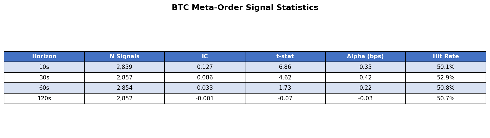
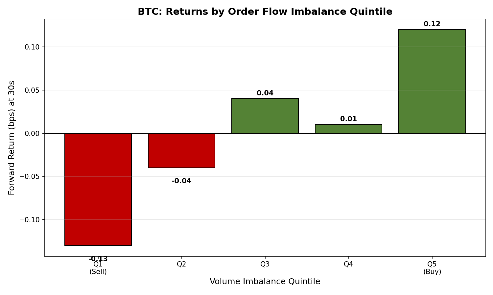
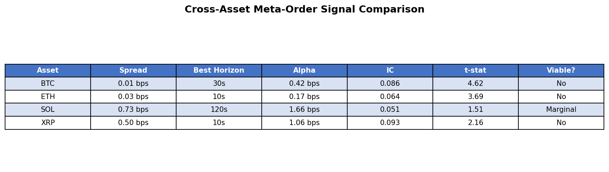
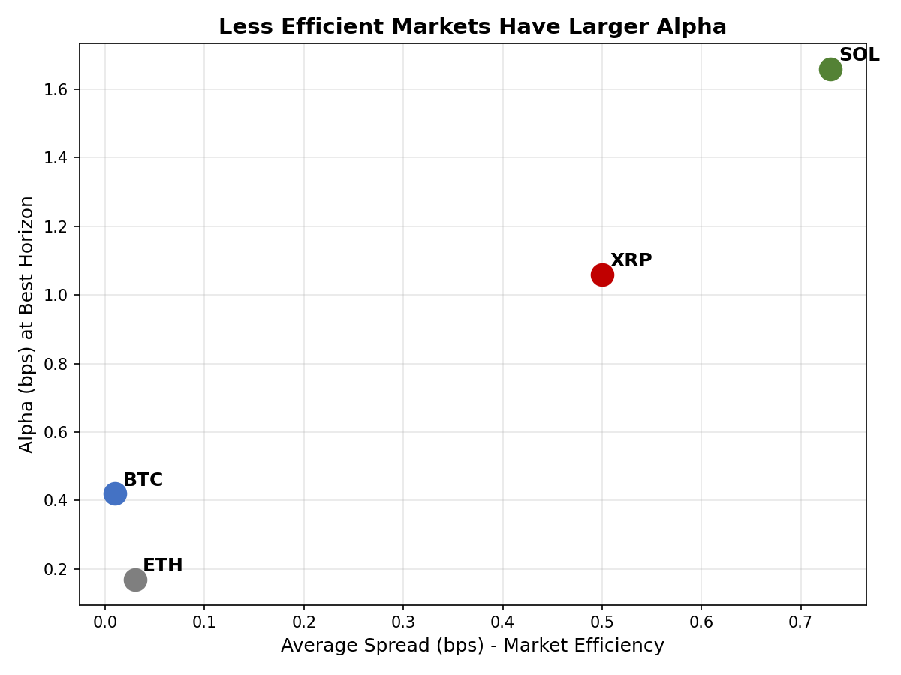
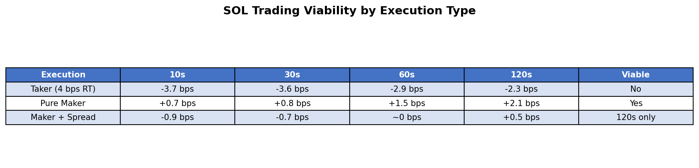

# Meta-Order Flow in Crypto Perps: Catching Big Whale

In this study, I tested whether short-horizon order book patterns can detect institutional meta-order flow in crypto perpetuals. The signal is real. The edge is small. For taker execution, the edge is not monetizable.

---

## Executive Summary

*Figure 1: Headline findings from the meta-order detection study.*

- The signal is statistically strong in BTC: IC around 0.10, t-stat up to 6.86 at short horizons.
- Signal direction is momentum, not reversal: buy pressure predicts further upside, and sell pressure predicts further downside.
- Raw alpha is small: BTC around 0.42 bps at 30s; best observed reading was SOL around 1.66 bps at 120s.
- At a 4 bps round-trip taker cost assumption, all tested configurations are negative net.
- The only plausible monetization path is selective maker-style execution in less efficient markets (mainly SOL), with strict fill and adverse-selection controls.

Bottom line: this is useful as an execution and microstructure signal, not as a standalone taker alpha strategy.

---

## 1) Research Question

Can we detect institutional execution flow from high-frequency L2 order book data and convert that information into tradable short-horizon alpha?

Large participants do not typically execute in one clip. They split size over time (TWAP/VWAP-like behavior), creating local signatures:

- Persistent one-sided pressure over multiple updates
- Unusually high order arrival intensity
- Sustained bid/ask volume imbalance

If those signatures are detectable in real time, they should contain directional information.

This setup is related to ideas explored in [When AI Trading Agents Compete: Adverse Selection of Meta-Orders by RL-Based Market Making](https://arxiv.org/abs/2510.27334), adapted here to a direct signal-testing framework.

---

## 2) Data and Experiment Design

I used two weeks of OKX perpetual futures L2 order book data:

- Assets: BTC, ETH, SOL, XRP
- Depth: 400 levels per side
- Update cadence: about 16ms (about 62 updates/sec)
- Sample period: January 18-31, 2026

This resolution is appropriate for short-horizon microstructure testing and close to what execution-focused crypto desks monitor.

---

## 3) Signal Construction

### Feature Set

The streaming feature engine computes, per update:

1. Volume imbalance  
`(bid_volume - ask_volume) / (bid_volume + ask_volume)`

2. Arrival-rate z-score  
Current order arrival intensity relative to a rolling 5-minute baseline

3. Imbalance persistence  
Whether imbalance has remained one-sided over a short window

### Trigger Logic

Signal fires when:

- Arrival-rate z-score > 1.5
- and absolute volume imbalance > 0.2

Direction mapping:

- Positive imbalance -> BUY
- Negative imbalance -> SELL

### Evaluation

- Information Coefficient (IC): correlation between signal and forward return
- t-statistic: significance of IC
- Hit rate: directional accuracy
- Alpha per signal (bps): average forward return conditional on signal

---

## 4) Core Results (BTC)

*Figure 2: BTC signal quality by holding horizon.*

Key outcomes:

- 10s horizon: highest predictive quality (IC 0.127, t=6.86)
- 30s horizon: best practical balance (IC 0.086, t=4.62, alpha 0.42 bps)
- 60s+ horizon: fast decay; by 120s, signal edge is near zero

This is exactly what you want from a microstructure feature: high short-horizon information, rapid half-life.

### Monotonicity Check (Quintiles)

*Figure 3: 30s forward returns by imbalance quintile during high-activity regimes.*

- Q1 (strongest sell pressure): -0.13 bps
- Q5 (strongest buy pressure): +0.12 bps
- Q5-Q1 spread: 0.25 bps

The relationship is monotonic. That materially reduces the chance we are looking at noise or overfit threshold artifacts.

### Directional Interpretation

Initial expectation was short-term reversion after one-sided flow. The data rejected that.

Observed behavior is momentum: aggressive one-sided pressure tends to continue, at least over 10-30 seconds. In practice, this is consistent with parent-order execution pressure that has not finished.

---

## 5) Cross-Asset Behavior

*Figure 4: Signal statistics across BTC, ETH, SOL, and XRP.*

*Figure 5: Efficiency-alpha tradeoff across assets.*

Cross-sectional pattern:

- BTC: strongest statistical stability, smallest alpha
- SOL: largest raw alpha, lower confidence
- ETH/XRP: intermediate behavior

Example contrast:

- BTC 30s alpha: 0.42 bps (t=4.62)
- SOL 120s alpha: 1.66 bps (t=1.51)

Interpretation: less efficient books can offer larger dislocations, but noise and execution friction rise with them.

*Figure 6: Alpha by horizon and asset with taker breakeven overlay.*

The red breakeven threshold shows the key result: gross alpha sits below realistic taker costs in every tested case.

---

## 6) Execution Reality: Where the Edge Breaks

*Figure 7: SOL net profile under different execution assumptions.*

### Scenario A: Taker (2 bps per side, 4 bps round trip)

- All configurations are net negative
- SOL 120s example: 1.66 - 4.00 = -2.34 bps net

### Scenario B: Pure Maker (0.2 bps rebate per side)

- Stylized upper bound with favorable passive fills
- SOL 120s example: 1.66 + 0.40 = +2.06 bps net

### Scenario C: Maker with realistic adverse selection / crossing risk

- Passive orders do not fill uniformly; many fills occur in worse local states
- Using an effective one-way friction of about 0.56 bps:
- SOL 120s example: 1.66 - 1.13 = +0.53 bps net

Only the last setup is operationally interesting, and even there the statistical confidence is moderate.

---

## 7) What This Means for a Data-Driven Crypto Investor

This signal should be treated as market state information, not standalone directional alpha.

Where it is useful:

- Execution timing: avoid crossing the spread against detected one-sided flow
- Quote skewing: tilt passive quotes toward the detected pressure regime
- Risk control: reduce contrarian exposure during high-intensity directional flow
- Feature stacking: combine with funding basis, session momentum, and volatility state filters

Where it is not useful:

- Pure taker momentum strategy at these horizons
- Portfolio-level signal without execution-aware implementation

Practical threshold: if expected gross edge is below your modeled all-in cost floor, it is not alpha, it is noise with confidence intervals.

---

## 8) Limitations and Next Research Pass

Current constraints:

- Short sample window (14 days)
- Fill-rate uncertainty under passive execution
- No full queue-position simulator in this pass

Next iteration priorities:

1. Build queue-aware maker simulator with stochastic fill modeling
2. Extend SOL sample to 30+ days for tighter confidence bands
3. Run regime segmentation (volatility buckets, session buckets, news windows)
4. Test ensemble signals instead of single-factor deployment

---

## Appendix: Technical Notes

### Processing Stack

- Source: OKX perpetual futures L2 order book via WebSocket
- Format: JSON lines (snapshot + incremental updates)
- Throughput: about 2M rows/minute in streaming mode
- Memory footprint: about 500MB with deque-based rolling windows

### Feature Definitions

| Feature | Formula |
|---------|---------|
| Volume Imbalance | (bid_vol - ask_vol) / (bid_vol + ask_vol) |
| Arrival Z-Score | (current_arrivals - mean_5min) / std_5min |
| Signal Trigger | z-score > 1.5 and abs(imbalance) > 0.2 |

### Cost Assumptions Used in This Post

| Cost Type | Value | Note |
|-----------|-------|------|
| Baseline Taker | 0.02% per side (2 bps) | Core scenario |
| Higher-Fee Taker | 0.05% per side (5 bps) | Sensitivity reference |
| Maker Rebate | -0.002% per side (-0.2 bps) | Stylized favorable passive case |
| Passive Fill Friction | spread/2 equivalent | Proxy for crossing/adverse selection drag |

---

## About This Research

- Date: February 2026
- Data: OKX L2 perpetual futures order book
- Reference: [arXiv:2510.27334](https://arxiv.org/abs/2510.27334)

*Disclaimer: This material is for research and educational purposes only. It is not investment advice. Trading digital assets involves substantial risk, including loss of principal.*

**Tags**: #QuantitativeFinance #Crypto #MarketMicrostructure #OrderFlow #MetaOrders #AlgorithmicTrading #Execution #MarketMaking
