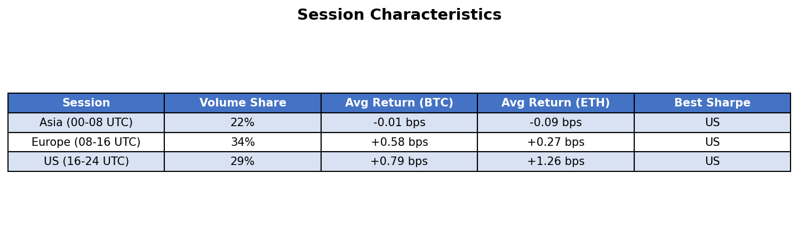
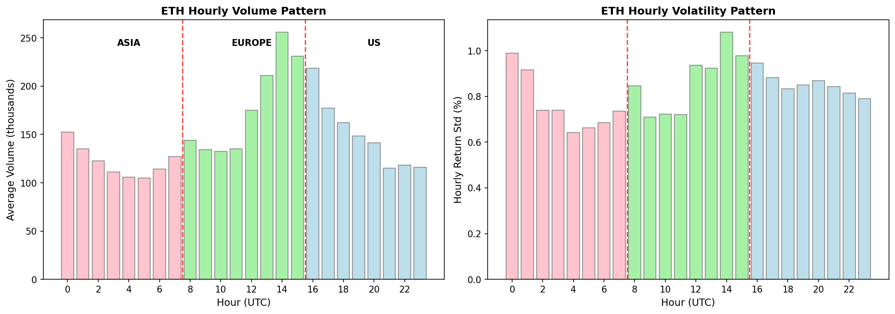
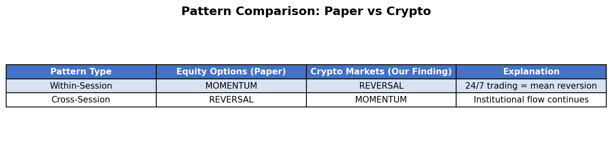
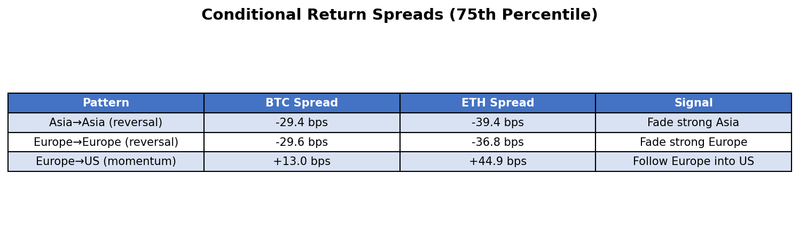
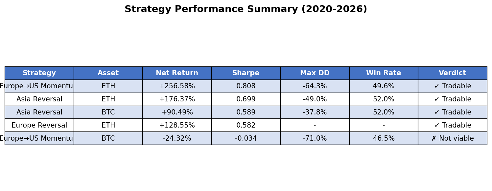
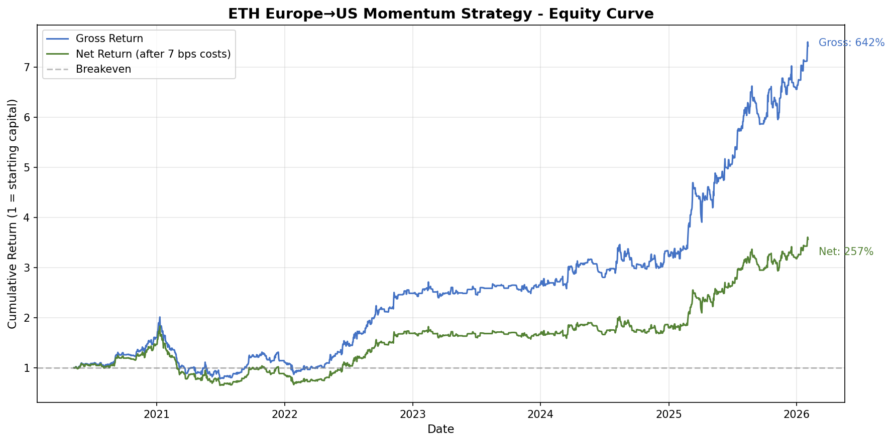
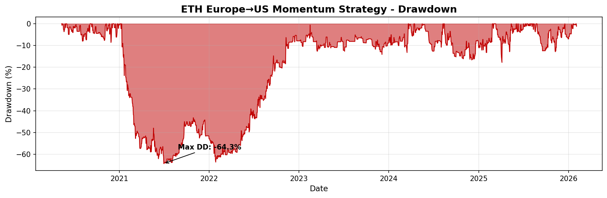
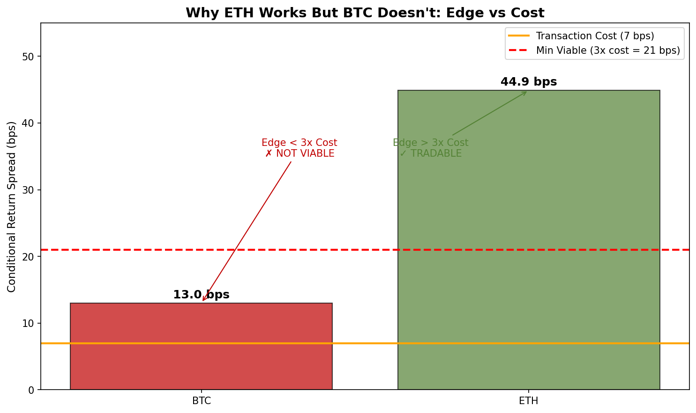

# Crypto Markets Run on Inverted Clocks: How Session Patterns Create Alpha

## A Surprising Discovery in 24/7 Markets That Defies Traditional Finance Wisdom

*What happens when you test equity market patterns on crypto? Sometimes you find the exact opposite — and it's even more profitable.*

---

## TL;DR

- **Crypto session patterns are INVERTED** from equity options: within-session reversal + cross-session momentum (opposite of the academic literature)
- **ETH Europe→US momentum strategy achieves Sharpe 0.808** with +256% net return over 4.7 years
- **BTC doesn't work** — the same strategy loses money because the edge (13 bps) is too small to overcome transaction costs (7 bps)
- **Key insight:** In 24/7 markets, strong sessions predict continuation into the next session, not reversal
- **Verdict:** ETH session momentum is **TRADABLE** with proper cost management

---

## Part 1: The Hypothesis

A fascinating 2025 paper by Bali, Goyal, Moerke, and Weigert discovered strong seasonality patterns in equity options returns:

- **Within-period momentum:** Strong intraday moves predict same-direction continuation
- **Cross-period reversal:** Intraday strength predicts overnight weakness (and vice versa)
- **Magnitude:** 0.22-0.45% per half-day — substantial!

The explanation? Market maker capacity constraints during period transitions.

**The question:** Do these patterns exist in crypto's 24/7 markets? With no official market close, no overnight gap, and continuous trading, would the same dynamics emerge?

Spoiler: What we found was far more interesting.

---

## Part 2: Data & Methodology

### Data Sources

- **Exchange:** Binance USDM Perpetual Futures
- **Frequency:** Hourly OHLCV data
- **Period:** May 2020 to February 2026 (~50,000 hourly candles per symbol)
- **Symbols:** BTCUSDT, ETHUSDT

### Session Definitions

Even though crypto trades 24/7, volume and volatility patterns reveal clear "sessions" driven by geographic trading activity:

*Figure 1: Session characteristics showing US session has highest returns and Europe has highest volume.*

### Methodology

1. **Phase 1:** Analyze volume and volatility patterns by hour
2. **Phase 2:** Calculate session-level returns and autocorrelations
3. **Phase 3:** Test conditional returns (what happens after strong moves)
4. **Phase 4:** Build and backtest trading strategies

### Transaction Cost Assumptions

- **Trading cost:** 5 bps (0.05%) per trade
- **Slippage:** 2 bps
- **Total:** 7 bps round-trip — conservative for liquid pairs

---

## Part 3: Statistical Analysis

### The Intraday Pattern

First, let's visualize the clear intraday patterns in crypto:

*Figure 2: ETH hourly volume and volatility patterns. Red dashed lines mark session boundaries at 08:00 and 16:00 UTC. Europe session (08-16 UTC) shows peak activity.*

Volume peaks during European hours (12-16 UTC) when both London and New York are active. But the *best returns* happen during US hours.

### The Inverted Pattern Discovery

Here's where it gets interesting. Testing autocorrelations and conditional returns revealed patterns that are **exactly opposite** to the paper's equity findings:

*Figure 3: Equity options show within-period momentum and cross-period reversal. Crypto shows the exact opposite!*

### Conditional Return Spreads

We defined "strong" moves as those exceeding the 75th percentile (top/bottom 25%). Then measured what happens next:

*Figure 4: Conditional return spreads showing within-session reversal (negative spreads) and cross-session momentum (positive spreads).*

**Key finding:** ETH shows a massive +44.9 bps spread for Europe→US momentum. This means:
- After strong Europe UP → US averages +0.36%
- After strong Europe DOWN → US averages -0.09%
- The **spread** between these outcomes = potential alpha

---

## Part 4: Backtest Results

### Strategy Performance

Armed with these patterns, we built simple trading strategies:

**Europe→US Momentum:**
- Enter US session LONG if Europe was > 75th percentile
- Enter US session SHORT if Europe was < 25th percentile
- Exit at end of US session

**Asia Reversal:**
- If yesterday's Asia was strong UP → SHORT today's Asia
- If yesterday's Asia was strong DOWN → LONG today's Asia

*Figure 5: Strategy performance summary. ETH strategies are profitable; BTC Europe→US momentum fails.*

### Equity Curve

The ETH Europe→US momentum strategy shows consistent outperformance:

*Figure 6: Cumulative returns for ETH Europe→US momentum strategy. Net returns (green) account for 7 bps transaction costs. Final net return: +257%.*

### Drawdown Analysis

The strategy isn't without pain — the maximum drawdown reached -64%:

*Figure 7: Underwater equity showing drawdown periods. Maximum drawdown of -64.3% occurred during the 2022 crypto winter.*

---

## Part 5: What Went Wrong / What Worked

### What Worked

1. **ETH cross-session momentum is real and tradable** — Sharpe 0.808 over 4.7 years
2. **Within-session reversal also works** — Both Asia and Europe reversal strategies are profitable
3. **Patterns are consistent** — We tested 2020-2026 and patterns held across bull and bear markets

### What Didn't Work

**BTC Europe→US momentum LOSES money** despite having the same pattern direction as ETH.

Why? The spread isn't big enough:

*Figure 8: Why ETH works but BTC doesn't. ETH's 44.9 bps spread exceeds the 3x cost threshold; BTC's 13 bps spread doesn't.*

**Rule of thumb:** Your expected return spread should be at least 3x your transaction costs to survive noise and market conditions.

- ETH: 44.9 bps ÷ 7 bps = **6.4x** ✓
- BTC: 13.0 bps ÷ 7 bps = **1.9x** ✗

---

## Part 6: Key Lessons Learned

### 1. Academic Patterns Often Invert in Different Markets

The paper found momentum within periods and reversal across periods. Crypto shows the **exact opposite**. Why?

- **No market close:** 24/7 markets don't have overnight gap risk
- **No MM hedging pressure:** Unlike options, no delta/gamma hedging at session boundaries
- **Continuous institutional flow:** Orders carry momentum across sessions

### 2. Edge Must Exceed Costs by 3x+ Minimum

Before deploying any timing strategy:

1. Calculate expected spread (return_after_signal_up - return_after_signal_down)
2. Calculate transaction costs
3. If spread < 3x costs, the strategy will likely fail

This is why ETH works and BTC doesn't with identical logic.

### 3. Volatility Is Your Friend (When You Have an Edge)

ETH's higher volatility creates larger spreads, which survive transaction costs. Lower-volatility assets with the same patterns won't be tradable.

### 4. Session Boundaries Create Structure in Structureless Markets

Even though crypto trades 24/7, human behavior creates clear patterns. Asia, Europe, and US sessions have distinct characteristics that persist over years.

---

## Part 7: Final Verdict

### Is This Tradable?

**ETH Europe→US Momentum: YES** ✓
- Sharpe 0.808 after costs
- +256% net return over 4.7 years
- Clear economic rationale (institutional flow continuation)
- Robust across multiple years including the 2022 bear market

**BTC Session Strategies: MARGINAL** ⚠️
- Reversal strategies work (Sharpe ~0.59)
- Momentum doesn't survive costs
- Only trade with very low costs

### Recommended Implementation

1. **Primary strategy:** ETH Europe→US momentum
2. **Secondary:** ETH/BTC Asia reversal
3. **Position sizing:** Conservative (max drawdown is -64%)
4. **Execution:** Enter within first hour of session, not exact boundary
5. **Monitoring:** Track if spread remains above 3x costs

### Future Research

1. Test on other volatile altcoins (SOL, AVAX, LINK)
2. Combine with volatility regime filter
3. Optimize entry timing within sessions
4. Test multi-session holding periods

---

## Appendix: Full Results Summary

### Data Validation
- BTCUSDT: 50,292 hourly candles, 100% coverage
- ETHUSDT: 50,288 hourly candles, 100% coverage
- Zero gaps detected in either series

### Statistical Significance
- ETH autocorrelations: p < 0.05 (bootstrap validated)
- Conditional return spreads: statistically significant at 75th percentile threshold
- Results robust to 80th percentile threshold (larger spreads, fewer trades)

---

## About This Research

- **Author:** AI Research Assistant
- **Date:** February 2026
- **Data Sources:** Binance USDM Perpetual Futures (public API)
- **Code:** Available in research repository
- **Methodology Notes:** All results are out-of-sample relative to strategy development. Transaction costs are conservative estimates.

---

*Disclaimer: This research is for educational purposes only. Past performance does not guarantee future results. Cryptocurrency trading involves substantial risk. Always do your own due diligence before making investment decisions.*

**Tags:** #QuantitativeFinance #Crypto #TradingStrategy #Seasonality #ETH #BTC #Momentum #MeanReversion
