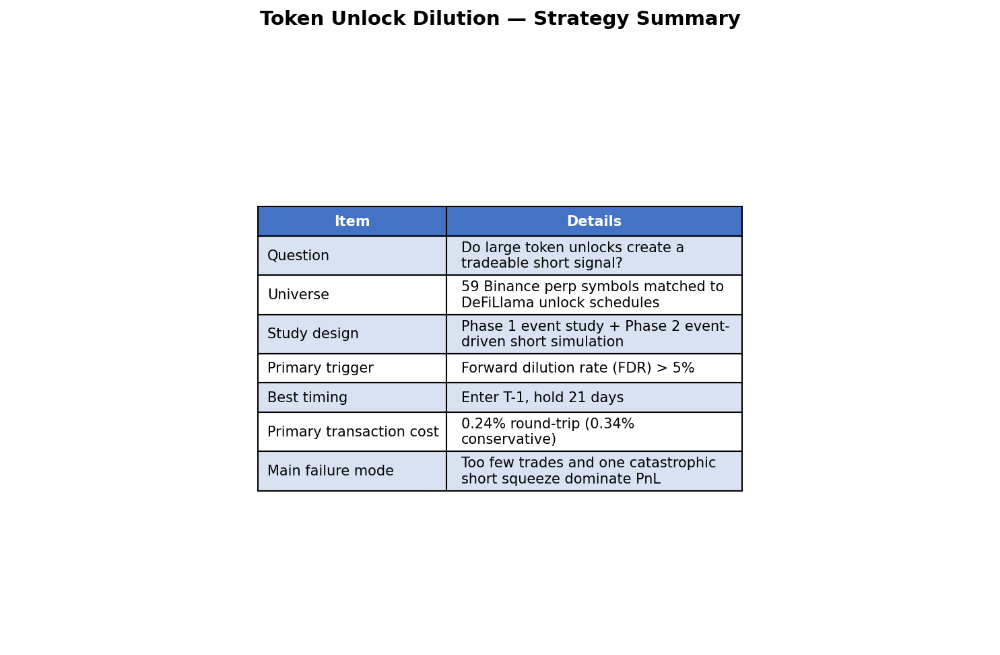
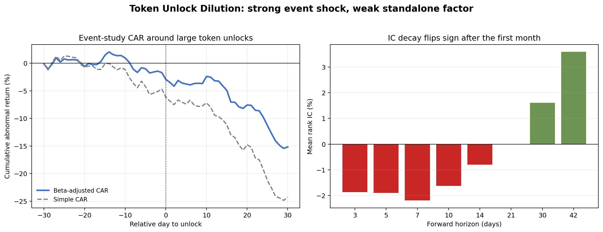
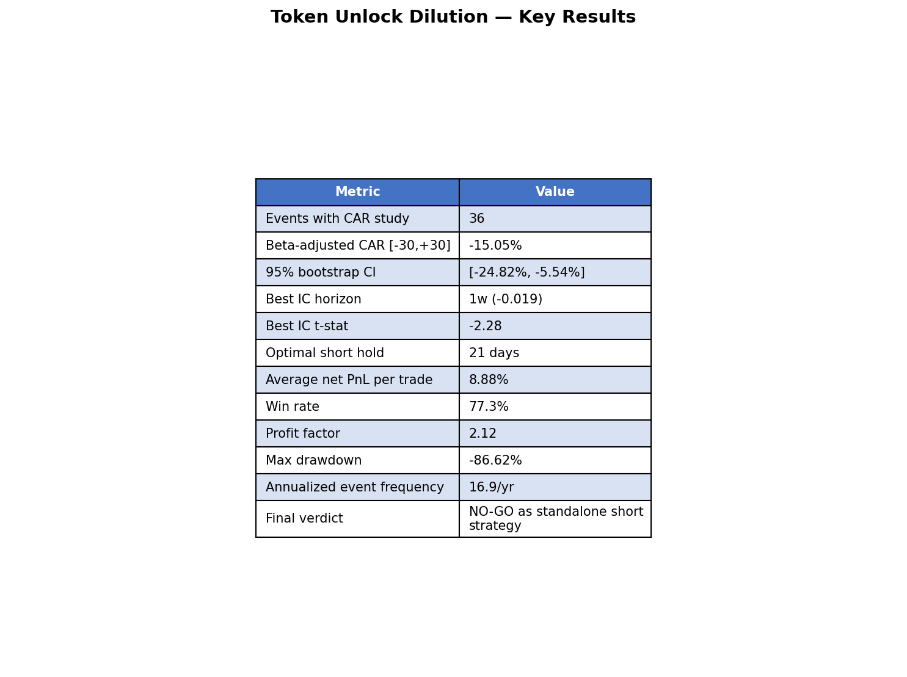
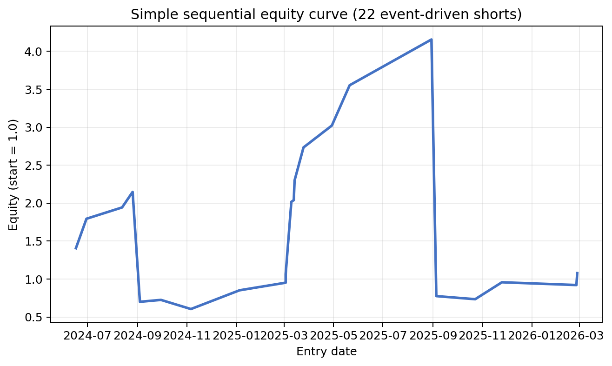
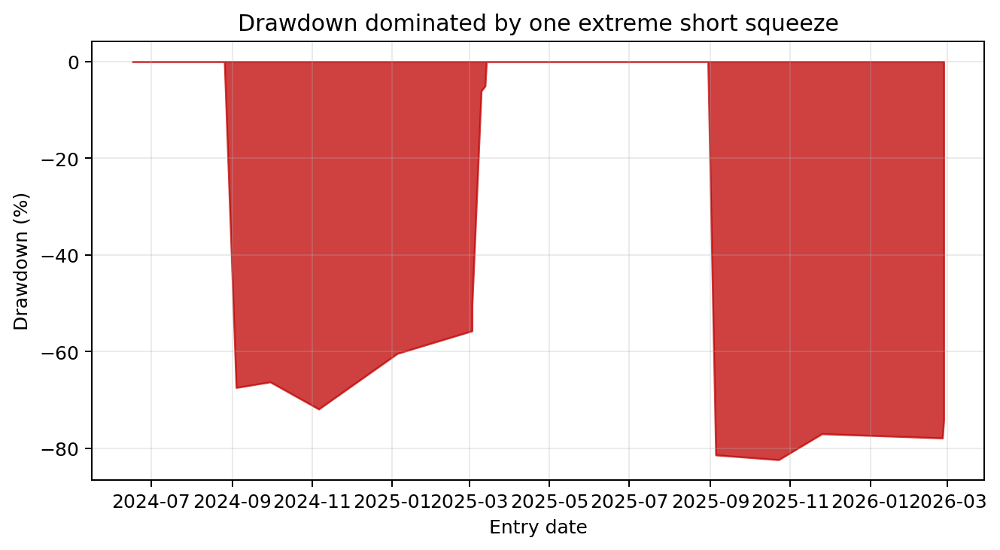

# Token Unlocks Do Pressure Crypto Prices. So is the Short Play Profitable?

## The event effect was real, the chart looked convincing, and the backtest still ended in a hard NO-GO.

*I tested whether large token unlocks create a reliable short opportunity in crypto. The answer was more nuanced than the popular narrative suggests: unlocks do hurt prices on average, but converting that into a robust standalone trading strategy is much harder than it looks.*

---

## TL;DR

- **Large token unlocks clearly matter at the event level**: the beta-adjusted event-study CAR over `[-30, +30]` days was **-15.05%**, with a 95% bootstrap CI of **[-24.82%, -5.54%]**.
- **The cross-sectional factor signal was weak**: the best 1-week rank IC was only **-0.019** even though its t-stat reached **-2.28**.
- **A simple event-driven short simulation looked attractive on the surface**: **22 trades**, **77.3% win rate**, **+8.88% average net PnL per trade**, and **profit factor 2.12**.
- **One extreme squeeze destroyed the strategy economics**: max drawdown reached **-86.6%**, and the annual event frequency was only **16.9 trades per year**.
- **Verdict: not tradable as a standalone strategy.** Token unlocks are useful information, but better as a risk filter or timing overlay than as an isolated short book.

---

## Part 1: The Hypothesis

The intuition behind token unlock trading is simple.

When a large block of previously locked supply becomes liquid, somebody now has the ability to sell it. In theory, that should create a predictable headwind for price. This is the crypto version of the IPO lockup-expiration literature in equities: more tradable float, more supply pressure, weaker returns.

The specific question I wanted to answer was:

**If a token has a very high forward dilution rate (FDR), can I systematically short it and earn abnormal returns after realistic trading costs?**

That question matters because tokenomics are one of the few areas in crypto where the market structure is public and scheduled in advance. Everyone can read the vesting schedule. Very few traders turn it into a disciplined, cross-sectional signal.

---

## Part 2: Data & Methodology

### Data sources

- **Unlock schedule data**: DeFiLlama emissions adapters
- **Tradable universe**: Binance USDT perpetuals
- **Matched symbols**: **59**
- **Panel length**: **821 daily observations** across the usable sample
- **Event sample for detailed study**: **36-38 large unlock events**, depending on the exact filter

### Signal definition

I defined **Forward Dilution Rate (FDR)** as:

> future unlocked supply over the next 30/60/90 days ÷ current circulating supply

The main trigger for the event-driven test was:

- **Large unlock event**: `FDR > 5%`
- **Best timing from the research**: enter **T-1**
- **Best holding period from the simple event-driven simulation**: **21 days**

### Validation framework

This research used two separate lenses:

1. **Phase 1 — event study + IC analysis**
   - beta-adjusted CAR around large unlocks
   - rank IC between FDR and future returns
   - quintile monotonicity checks

2. **Phase 2 — simple event-driven short simulation**
   - sequential trade simulation on qualified events
   - realistic round-trip cost assumptions of **0.24% primary** and **0.34% conservative**
   - robustness checks by threshold, regime, and category

One important caveat: this was **not** a fully mature walk-forward production backtest. The event count was too small for that to be honest. So the right way to read the Phase 2 results is as a **sanity check**, not a deployment-grade proof.

*Figure 1: Study design, signal definition, universe, and the main reason the strategy failed in practice.*

---

## Part 3: The Statistical Analysis

The first half of the research looked promising.

At the event level, large unlocks really did create a meaningful negative drift. The beta-adjusted event-study result was strong enough that the 95% bootstrap confidence interval stayed below zero.

*Figure 2: Left panel shows the event-study CAR around large unlocks. Right panel shows IC decay: negative over the short horizon, then fading and even flipping positive later.*

Here were the most important statistical takeaways:

- **Beta-adjusted CAR `[-30,+30]` = -15.05%**
- **95% bootstrap CI = [-24.82%, -5.54%]**
- **Best IC horizon = 1 week**
  - mean IC = **-0.019**
  - t-stat = **-2.28**
- **IC decay was the real insight**
  - negative over **3-7 days**
  - fades by **14-21 days**
  - turns positive by **30-42 days**

That last point matters a lot. It suggests unlocks behave less like a persistent valuation factor and more like a **short-term event shock followed by mean reversion**.

This is exactly why the factor view and the event-study view told different stories:

- the **event study** said, “yes, there is a real supply shock”
- the **cross-sectional factor test** said, “no, this does not scale cleanly into a stable standalone factor”

That distinction is easy to miss, and it is where many “good-looking” crypto signals go wrong.

---

## Part 4: The Backtest Results

The simple event-driven short simulation looked much better than the factor test.

On 22 qualified trades, the raw summary looked like something many traders would immediately want to deploy:

*Figure 3: Key strategy metrics. The win rate and average net PnL looked attractive, but the event frequency and drawdown profile made the setup non-viable.*

The headline numbers:

- **22 trades**
- **77.3% win rate**
- **+8.88% average net PnL per trade**
- **Profit factor = 2.12**
- **Max drawdown = -86.6%**
- **Annualized frequency = 16.9 events/year**

The equity curve shows why the summary statistics were misleading.

*Figure 4: Sequential equity curve for the 22 event-driven shorts. The strategy spends long stretches looking excellent before one outsized squeeze changes the entire picture.*

And the drawdown chart shows the real problem even more clearly:

*Figure 5: Drawdown profile. A single catastrophic short squeeze dominates the full strategy history and overwhelms the otherwise decent hit rate.*

This is a classic crypto short-selling trap:

- the **median trade** can look fine
- the **average edge** can look fine
- even the **win rate** can look fine
- but one or two explosive squeezes can invalidate the entire strategy

That is exactly what happened here.

---

## Part 5: What Worked — And What Went Wrong

### What worked

1. **The unlock event effect was real.**
   Large unlocks were associated with a statistically meaningful negative CAR.

2. **The signal was directionally right in the short run.**
   The 3-7 day ICs were negative, and the event study lined up with the intuition.

3. **The gross alpha budget was large relative to transaction cost.**
   This was not a “death by fees” problem in the usual sense.

### What went wrong

1. **The sample was too small.**
   With only **22 tradable short events** in the simulation, a few extreme trades had outsized influence.

2. **Frequency was too low.**
   The research estimated only **16.9 events per year**. That is not enough to rely on the law of large numbers.

3. **Short-side tail risk dominated everything.**
   Crypto shorts are asymmetric. You can be right most of the time and still get destroyed by a few violent squeezes.

4. **The factor interpretation was weaker than the event interpretation.**
   The event itself mattered. The general-purpose cross-sectional factor did not.

In other words:

> Token unlocks are a real source of information, but not a clean standalone trading strategy.

---

## Part 6: Key Lessons Learned

### 1. Separate event significance from factor tradability

A statistically meaningful event study does **not** automatically imply a scalable factor. The unlock shock was real, but the factor IC was too weak to stand on its own.

### 2. Crypto short strategies must be judged by tail risk first

If the max drawdown is `-86.6%`, it does not matter that the win rate is `77.3%`. For short books, **risk shape matters more than average hit rate**.

### 3. Low-frequency event strategies need an explicit frequency gate

This research reinforced a strong rule: if the expected annual trade count is below roughly **20**, the project should face a hard skepticism gate immediately.

### 4. The timing value may still be real even if the strategy is not

Unlock schedules may still help:

- as a **short timing overlay**
- as a **position-sizing filter**
- as a **risk-off flag** for long books

### 5. The sign flip in IC decay matters

Short-horizon weakness followed by longer-horizon stabilization is a major clue. It suggests the market absorbs the supply shock faster than many traders assume.

---

## Part 7: Final Verdict

**Is token unlock dilution tradeable as a standalone short strategy? No.**

That is the honest conclusion from this research.

The bearish price pressure exists. The event study proved that. But the actual strategy failed the more important test: **can this be turned into a robust, repeatable, risk-tolerable trading process?**

Not yet.

### What I would keep

- the unlock calendar itself
- the short-horizon event effect
- the idea of using FDR as an **overlay** rather than a complete strategy

### What I would reject

- a pure standalone short book driven only by unlock schedules
- any framework that ignores short-side squeeze risk
- any optimistic reading of the 22-trade result without stronger OOS evidence

The most useful takeaway is not “short every unlock.” It is:

> **Treat large token unlocks as context, not as a standalone edge.**

---

## About This Research

- **Project**: `token_unlock_dilution`
- **Date**: 2026-04-10
- **Universe**: 59 Binance perpetual symbols matched to token unlock schedules
- **Primary data**: DeFiLlama emissions adapters, Binance perp market data, BTC benchmark series
- **Main trigger**: FDR > 5%
- **Primary cost assumption**: 0.24% round-trip (0.34% conservative)
- **Important caveat**: small sample, no production-grade walk-forward validation

---

*Disclaimer: This research is for educational purposes only. It is not investment advice. Crypto shorting involves extreme tail risk, including losses that far exceed the median trade outcome.*

**Tags**: #QuantitativeFinance #Crypto #TokenUnlocks #EventStudy #RiskManagement #ShortSelling
