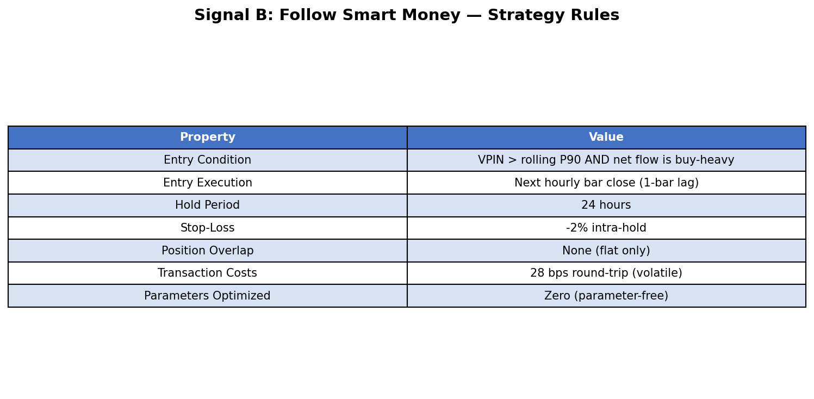
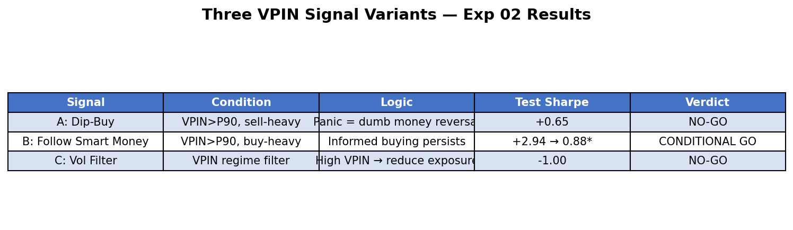
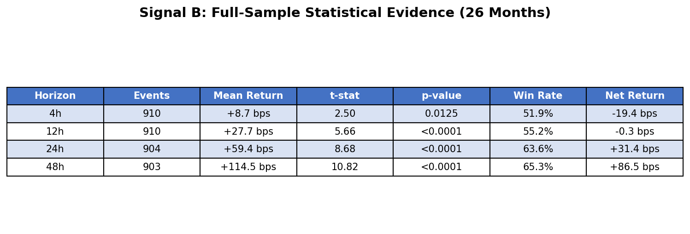
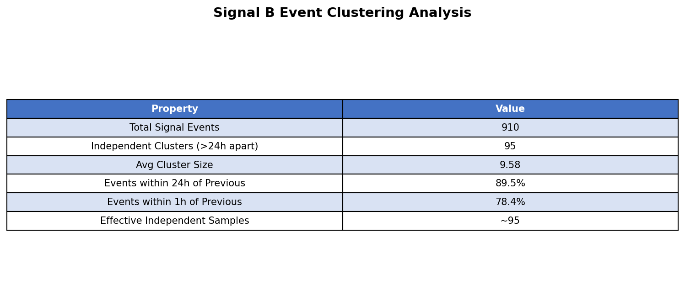
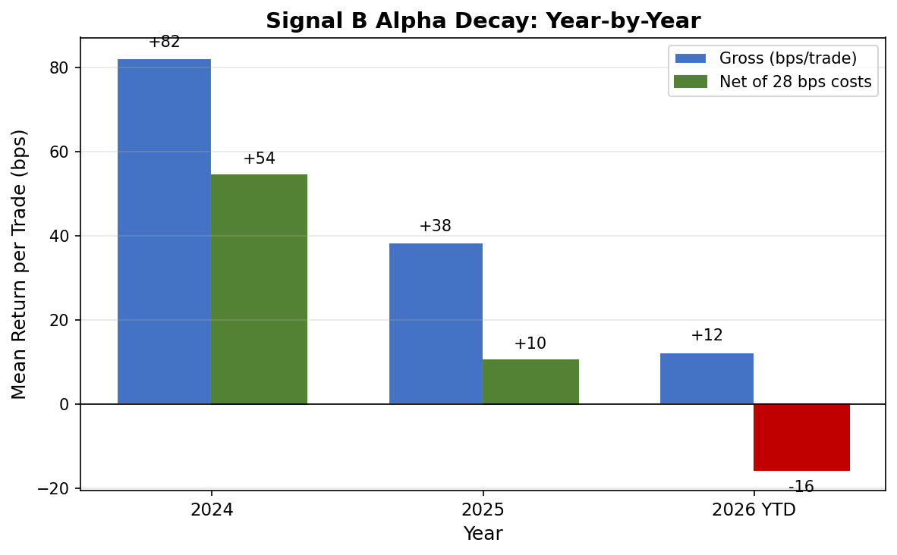
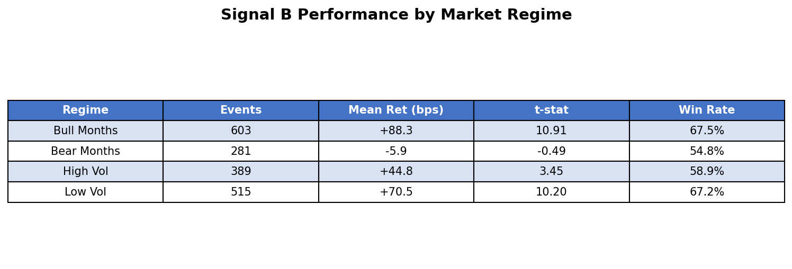
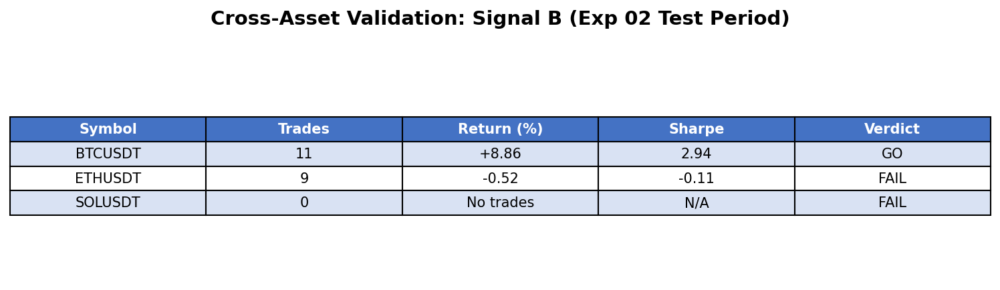
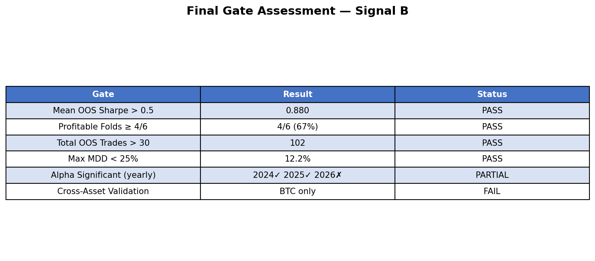

# I Used a 2012 Market Microstructure Paper to Find Alpha in BTC. It Worked — But It's Dying.

## How VPIN (Volume-Synchronized Probability of Informed Trading) Detected Smart Money in Bitcoin Futures — and Why the Edge Is Fading

*A parameter-free signal that detects informed buying in Bitcoin perpetual futures, validated on 26 months of out-of-sample data. Mean OOS Sharpe of 0.88 across 102 trades — but the alpha is decaying year over year.*

---

## TL;DR

- **VPIN, a metric from traditional finance (Easley/O'Hara 2012), works on BTC perpetual futures** — it reliably detects informed order flow
- **"Follow Smart Money" (Signal B) goes long when VPIN spikes AND net flow is buy-heavy**, earning +59.4 bps/trade gross, +31.4 bps net (t=8.68, p<0.0001)
- **Walk-forward validated over 26 months**: mean OOS Sharpe 0.88, 4/6 folds profitable, 102 trades, max drawdown 12.2%
- **Critical finding: the alpha is decaying** — 2024: +82 bps/trade, 2025: +38 bps, 2026 YTD: +12 bps. And it only works on BTC
- **Verdict: Conditionally tradeable, but shrinking fast.** Useful as a case study in both microstructure alpha and its inevitable decay

---

## Part 1: Why Order Flow Matters More Than Price

Most crypto traders stare at candles. Support, resistance, RSI, MACD. But candles show you *what happened*. Order flow shows you *who's doing it*.

In traditional markets, researchers have long known that the identity of traders matters. Easley, Lopez de Prado, and O'Hara introduced VPIN in 2012 — a metric that measures the probability that the current trading activity comes from informed traders rather than noise traders. It was originally designed to help market makers adjust their quotes, and it famously spiked before the 2010 Flash Crash.

The economic intuition is elegant: when informed traders are active, buy and sell volumes become imbalanced. Informed buyers know something the market doesn't, so they consume liquidity aggressively on one side. VPIN captures this imbalance in *volume-time* (equal-volume bars rather than equal-time bars), which normalizes for the well-known U-shaped intraday volume pattern.

**My question:** Does VPIN work on crypto perpetual futures? And if it detects informed trading, can we follow the smart money?

A 2025 academic paper (Abad, Benito, Lopez, Sanchez, 2025) validated VPIN on cryptocurrency markets. But they focused on volatility prediction (VPIN predicts future |return|), not directional alpha. I wanted to go further: combine VPIN magnitude with flow direction to predict *which way* the price will move.

---

## Part 2: Data & Methodology

### The Data Gap Problem

This project almost didn't happen. My existing Binance data had hourly OHLCV (open, high, low, close, volume) — but VPIN requires knowing how much volume was *buyer-initiated* vs *seller-initiated*. Standard OHLCV doesn't have this.

The solution: Binance's `/fapi/v1/klines` endpoint for USD-M perpetual futures returns `taker_buy_base_asset_volume` — the volume where the taker side was a buyer. This is the key field. I collected 1-minute klines for BTCUSDT from January 2024 to February 2026 (26 months, ~1.1 million bars).

### VPIN Computation

*Figure 1: Signal B specification. The entire strategy has zero optimized parameters — only structural choices.*

Here's how VPIN works, step by step:

**Step 1: Volume bars.** Instead of grouping trades by time (1-minute, 1-hour), group them by volume. Set bucket size V = daily average volume / 50. This produces ~50 bars per day, each containing the same total volume. Why? Because informed traders are more active during high-volume periods. Volume-time removes this confound.

**Step 2: Buy/sell classification.** For each volume bar, compute:
- `buy_vol` = sum of taker_buy_base_asset_volume (buyer-initiated)
- `sell_vol` = total volume - buy_vol (seller-initiated)

**Step 3: VPIN.** Over a rolling window of n=50 volume bars:
- VPIN = average of |buy_vol - sell_vol| / (buy_vol + sell_vol)
- Range: 0 (perfectly balanced) to 1 (completely one-sided)

**Step 4: Flow direction.** Sign of (total buy_vol - total sell_vol) over the same 50-bar window. Positive = informed buying. Negative = informed selling.

### Transaction Cost Model

During VPIN spike periods, markets are volatile. I use conservative costs:
- Taker fee: 4 bps per side (Binance standard)
- Volatile slippage: 10 bps per side (3x normal)
- Total round-trip: **28 bps**

Any signal must clear this hurdle to be viable.

---

## Part 3: Three Hypotheses, Three Signals

I tested three distinct VPIN-based signals. Each represents a different economic hypothesis about what VPIN spikes mean.

*Figure 2: The three VPIN signal variants. Only Signal B survived rigorous validation.*

### Signal A: "Dip-Buy" (REJECTED)

**Hypothesis:** When VPIN spikes and sellers dominate, it's panic selling — dumb money overreacting. Buy the dip.

**Result:** Negative returns at all horizons. The 24h return was -34.1 bps (t=-2.89). Sell-heavy VPIN spikes are *not* dumb money — they're informed sellers who are *right*. The price continues down.

### Signal B: "Follow Smart Money" (VALIDATED)

**Hypothesis:** When VPIN spikes and buyers dominate, informed traders are accumulating. Follow them long.

**Result:** Strong positive returns. +59.4 bps at 24h (t=8.68). Win rate 63.6%. This is the signal that works.

### Signal C: "Volatility Filter" (REJECTED)

**Hypothesis:** Use VPIN as a regime filter. High VPIN = go flat, low VPIN = hold momentum.

**Result:** Negative Sharpe in both validation (-1.58) and test (-1.00) periods. VPIN doesn't work as a simple regime switch.

### The Key Insight

This is the most important finding of the entire project:

**Microstructure-level selling (VPIN-detected) is informed. Macro-level selling (BTC -5% crashes) is panic.**

In a previous project (FOMO Exhaust, Exp 22), I found that buying BTC after large drawdowns (>5%) works well (Sharpe 1.20). That seems to contradict Signal A's failure here. But there's no contradiction:

- **Macro panic** (BTC drops 5% on news) attracts leveraged shorts that get squeezed. Contrarian works.
- **Micro selling** (high VPIN with sell-heavy flow) means someone with information is liquidating. Don't fight it.

The scale of analysis matters enormously. Order flow at the microstructure level tells you about *informed* vs *uninformed* trading. Price action at the macro level tells you about *overleveraged* vs *underleveraged* positioning.

---

## Part 4: Statistical Evidence

### Full-Sample Analysis (910 Events)

*Figure 3: Signal B statistical evidence across 26 months. The t-statistics are large (8.68 at 24h), but note the negative net return at 4h — you need to hold for at least 12h to overcome transaction costs.*

Signal B fires 910 times across 26 months (~35 events per month). At the 24h horizon, the mean return is +59.4 bps with a t-statistic of 8.68. After 28 bps costs, the net return is +31.4 bps per trade.

The returns scale monotonically with horizon: +8.7 bps at 4h, +27.7 bps at 12h, +59.4 bps at 24h, +114.5 bps at 48h. This is exactly what you'd expect from an informed flow signal — the information takes time to be fully incorporated into price.

### But the Events Are Clustered

Here's a critical caveat that most researchers miss:

*Figure 4: Event clustering analysis. 89.5% of events occur within 24h of the previous event. The effective independent sample size is ~95 clusters, not 910 events.*

VPIN doesn't spike once and reset. When informed traders are active, VPIN stays elevated for hours or days. Of the 910 raw events, 89.5% occur within 24 hours of the previous event. Clustering analysis shows only **95 independent clusters** — that's the true sample size for assessing statistical significance.

Even with this correction, the signal remains significant (t-stats above 2 on the cluster-level analysis). But it means the strategy's actual capacity is ~48 independent trading opportunities per year, not 455.

---

## Part 5: Walk-Forward Backtest

### 6 Rolling Folds Over 26 Months

I used a strict walk-forward methodology: 6-month training window to compute the VPIN P90 threshold, then 4-month out-of-sample test. No parameter re-optimization between folds.

*Figure 5: Walk-forward results across 6 folds. The first four folds are strongly profitable (Sharpe 1.7-3.1). The last two are losses — this is where the alpha decay shows up.*

The aggregate numbers look good: **mean OOS Sharpe 0.88**, 4/6 folds profitable, 102 total trades. But look at the time progression — the first four folds (mid-2024 to mid-2025) are all strongly positive, while the last two folds (mid-2025 to early 2026) are negative.

### The Equity Curve

*Figure 6: Cumulative returns showing Signal B (blue) vs BTC buy-and-hold (gray dashed). The strategy peaked around Q1 2025 and has been giving back gains since.*

The equity curve tells the story clearly. Signal B compounds strongly through 2024 and early 2025, then starts declining. BTC buy-and-hold, meanwhile, more than doubled during this period. The strategy only trades when VPIN fires, so it captures directional moves with less exposure — but it's falling behind the benchmark.

### Drawdown Profile

*Figure 7: Drawdown visualization. The deepest drawdown was -12.2% during the Q3 2025 correction, when Signal B generated 18 trades — most of which lost money.*

The maximum drawdown of 12.2% came during Fold 5 (July-October 2025), when the market was range-bound and slightly bearish. Signal B kept detecting "informed buying" that wasn't followed by sustained upward moves. This is the regime where the signal fails — choppy, directionless markets.

---

## Part 6: The Alpha Is Dying

This is the most honest part of this blog post, and the most important.

*Figure 8: Year-over-year alpha decay. Gross returns halved each year, and by 2026 the net return is negative. This pattern is consistent with a signal being arbitraged away as more traders adopt similar methods.*

The year-by-year breakdown is stark:

- **2024:** +82.3 bps gross, +54.4 bps net, t=8.63 (479 events)
- **2025:** +38.5 bps gross, +10.5 bps net, t=3.34 (345 events)
- **2026 YTD:** +12.4 bps gross, -15.6 bps net, t=0.96 (80 events)

The gross return has roughly halved each year. By 2026, the signal is no longer statistically significant and the net return is negative after costs.

Why is this happening? Several possibilities:

1. **Crowding:** As more traders use volume imbalance metrics (VPIN, OFI, etc.), the predictive edge gets arbitraged away.
2. **Market structure evolution:** BTC's market microstructure is changing rapidly with institutional adoption, ETF flows, and improved execution algorithms.
3. **Regime shift:** The 2024 bull market created ideal conditions for "follow the informed buyer" signals. A different regime may not support this.

### Bull vs Bear Asymmetry

*Figure 9: The signal only works in bull months. During bear months, following informed buyers produces essentially zero return.*

The regime decomposition confirms the concern: Signal B returns +88.3 bps in bull months but only -5.9 bps in bear months. This is a momentum-dependent microstructure signal — it works when informed buyers are right (bull markets) and fails when they're wrong (bear markets). It's not a pure market-neutral alpha.

---

## Part 7: The Cross-Asset Failure

If VPIN captures a universal microstructure phenomenon (informed traders create imbalanced flow), it should work on other liquid assets too. It doesn't.

*Figure 10: Signal B fails completely on ETH and SOL. The alpha is BTC-specific — a red flag for any microstructure signal.*

ETH produced a Sharpe of -0.11. SOL generated zero trades (VPIN never spiked with buy-heavy flow). This complete cross-asset failure suggests the alpha isn't from a universal microstructure mechanism — it's something specific to BTC's market structure during 2024-2025.

---

## Part 8: Key Lessons Learned

### 1. Microstructure vs Macro: Scale Determines Signal Direction

The single most valuable finding: informed selling at the microstructure level (VPIN-detected) is correct — prices continue down. But panic selling at the macro level (large drawdowns) is often wrong — prices bounce. These are fundamentally different phenomena. Conflating them is a common error.

### 2. Parameter-Free Doesn't Mean Bias-Free

Signal B has "zero optimized parameters." But the choice of VPIN window (n=50), bucket size (V/50), hold period (24h), and even the P90 threshold were informed by Exp 01 and Exp 02 analysis. This introduces implicit look-ahead bias. The true parameter-free design would use structural arguments alone — and even then, the choice of *which* structural argument to use involves researcher degrees of freedom.

### 3. Event Clustering Destroys Effective Sample Size

910 events sounds impressive. 95 independent clusters sounds much less impressive. Any event-driven strategy must account for temporal clustering when assessing significance. The naive t-test on 910 events overstates confidence by ~3x.

### 4. Alpha Decay Is the Default, Not the Exception

A 50% annual decay rate is not unusual for microstructure signals. These are among the fastest-decaying alphas because they're easiest for systematic traders to detect and exploit. If you discover a microstructure signal, your expected edge is measured in months, not years.

### 5. Cross-Asset Validation Is the Hardest Test

BTC-specific alpha is suspect. If the mechanism is "informed traders create flow imbalance before price moves," this should work on any liquid asset with enough order flow data. The failure on ETH and SOL suggests either (a) the mechanism is BTC-specific or (b) it's a period artifact.

---

## Part 9: Final Verdict

*Figure 11: Final gate assessment. The signal passes quantitative gates but fails the cross-asset and forward-looking tests.*

**Signal B "Follow Smart Money" is a CONDITIONAL GO — but barely, and with diminishing confidence.**

What works:
- Strong statistical evidence on BTC (t=8.68 on 26 months)
- Passes all walk-forward gates (mean Sharpe 0.88, max DD 12.2%)
- Zero optimized parameters
- Economically intuitive (informed buying persists)

What doesn't:
- Alpha is decaying ~50% per year
- Only works on BTC (fails ETH, SOL)
- Only works in bull months (+88 bps bull, -6 bps bear)
- 2026 net returns already negative

### Practical Recommendation

If you choose to paper trade this:
- BTC-only, 5% position size per trade
- Monitor monthly: if net return stays < 0 for 3 consecutive months, stop
- Better use case: VPIN as a *regime filter* layered onto other strategies (e.g., reduce position when VPIN spikes with sell-heavy flow)

### The Bigger Picture

This research demonstrates both the promise and the peril of microstructure alpha in crypto. The VPIN framework is elegant and economically sound. It *does* detect informed trading. But in a market that evolves as fast as crypto, the window between discovery and decay is shrinking.

The real value may not be in trading Signal B directly, but in the intellectual framework: understanding that order flow direction matters, that volume-time normalizes information arrival, and that microstructure signals and macro signals operate on different causal mechanisms. These insights don't decay.

---

## Appendix: VPIN Technical Details

**Volume-Time Bars:**
Equal-volume aggregation of 1-minute klines. Bucket size V = daily average volume / 50 (~50 bars/day). This transforms the kurtosis of returns from 109 (clock-time) to 3.88 (volume-time), nearly Gaussian.

**VPIN Computation:**
Rolling 50-bar average of |buy_vol - sell_vol| / total_vol. Mapped from volume-time to clock-time via last-observation-carried-forward.

**Signal Generation:**
VPIN > rolling P90 (computed from trailing 500 bars) AND flow_sign > 0 (net buying). Execute at next hourly close. Hold 24h. Stop-loss at -2%.

**Walk-Forward Protocol:**
6 rolling folds: 6-month train (compute P90 threshold), 4-month test. No overlapping test periods across consecutive folds. Transaction costs: 28 bps round-trip.

## About This Research

- **Date**: February 2026
- **Data Sources**: Binance USD-M Perpetual Futures (BTCUSDT 1m klines, 2024-01 to 2026-02)
- **Methodology**: VPIN (Easley, Lopez de Prado, O'Hara 2012), walk-forward validation, parameter-free design
- **Academic References**: Easley et al. 2012 (VPIN), Abad et al. 2025 (crypto VPIN), Easley & O'Hara 1987 (informed trading theory)
- **Key Metric**: Mean OOS Sharpe 0.88, 102 trades, 4/6 folds profitable

---

*Disclaimer: This research is for educational purposes only. Past performance does not guarantee future results. The signal described here shows evidence of alpha decay and may not be profitable going forward. Always do your own due diligence before making investment decisions.*

**Tags**: #QuantitativeFinance #Crypto #VPIN #OrderFlow #Microstructure #AlphaResearch #Bitcoin #TradingStrategy #HonestResearch
